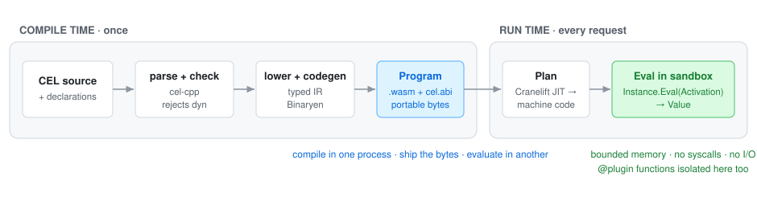
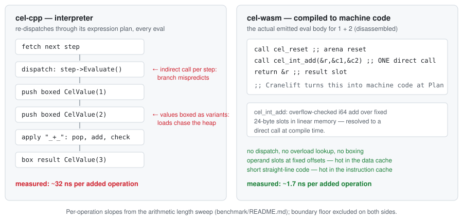

# cel-wasm

[](conformance/README.md)
[](LICENSE)

**cel-wasm is an ahead-of-time compiler and runtime for
[CEL](https://github.com/google/cel-spec), the policy expression language
of [Kubernetes](https://kubernetes.io/),
[Envoy](https://www.envoyproxy.io/), and
[Google Cloud IAM](https://cloud.google.com/iam).**
It compiles a type-checked CEL expression to a portable WebAssembly
*Program*, then JITs it to machine code. Evaluation runs native code in a
sandbox. No AST-walking interpreter. No host access beyond explicitly
granted imports.

Status: **beta**

The pipeline, sandbox, and conformance results are reproducible.
Remaining hardening work is listed under
[Limitations](#limitations). Parts of the documentation and the fuzz
suite are stale and being updated.

## CEL in 60 seconds

*Skip ahead if you already use CEL.*

CEL is Google's Common Expression Language: a small,
**non-Turing-complete** language for rules. A rule is one
statically-typed, side-effect-free expression. Evaluation always
terminates. The canonical example from the CEL spec:

```cel
// Approve the withdrawal?
account.balance >= transaction.withdrawal
    || (account.overdraftProtection
    && account.overdraftLimit >= transaction.withdrawal - account.balance)
```

Your service declares `account` and `transaction`, binds values at
request time, and gets back a `bool`. Expressions cannot loop, mutate
state, or do I/O. That makes them safe to accept from a config file or a
customer — and it is why
[Kubernetes](https://kubernetes.io/docs/reference/using-api/cel/),
[Envoy](https://www.envoyproxy.io/) / [Istio](https://istio.io/), and
[Google Cloud IAM](https://cloud.google.com/iam/docs/conditions-overview)
use CEL for policy.

## Quick start

```bash
# One-time: fetch the vendored parser/type-checker, build the CLI.
third_party/fetch_cel_cpp.sh
bazel build //tools/cel:cel

# Evaluate CEL end-to-end: compile → wasm → JIT → native.
bazel-bin/tools/cel/cel eval '1 + 2 + 3'                          # => 6
bazel-bin/tools/cel/cel eval 'a * b' --var a:int=6 --var b:int=7  # => 42

# Compile to a wasm artifact you can ship and evaluate elsewhere.
bazel-bin/tools/cel/cel compile 'a * b + 1' \
    --var a:int --var b:int --output /tmp/expr.wasm

# Or build and run the smallest complete embed:
bazel build //examples:01_hello_world && bazel-bin/examples/01_hello_world
```

Embedding from C++:

```cpp
#include "compiler/compiler.h"
#include "eval/engine.h"

using namespace celwasm;

auto builder = Compiler::NewBuilder();
builder.DeclareVariable("age", CelType::Int())
    .DeclareVariable("country", CelType::String());
auto compiler = std::move(builder).Build().value();

auto program = compiler.Compile("age >= 18 && country in ['US', 'CA']").value();

auto engine   = Engine::NewBuilder().Build().value();  // once per process
auto instance = engine.Plan(program).value();          // JIT, once per program

Activation act;
act.Bind("age", Value::Int(25))
   .Bind("country", Value::String("US"));
bool allowed = instance.Eval(act)->AsBool().value();   // => true
```

This is [`examples/02_variables.cc`](examples/02_variables.cc),
condensed. Every doc snippet is a buildable target, run on each
`bazel test` sweep. More in [`examples/`](examples/): saving and
reloading programs, custom functions, partial evaluation, protobuf
messages, error handling.

## Why compile CEL to WebAssembly?

Every CEL host today embeds its own interpreter: `cel-cpp`, `cel-go`,
`cel-rust`. The implementations drift in behavior and performance. And
policy runs in-process, where a hostile expression is a liability.

cel-wasm compiles the expression once, to sandboxed WebAssembly. That
buys three properties:

- **One source of CEL semantics.** Only the compiler understands CEL.
  Every host runs the identical `.wasm` bytes, so cross-language drift
  is structurally impossible.
- **Sandboxed by construction.** Bounded linear memory. No syscalls, no
  I/O. Host access only through explicitly granted imports. Termination
  is the language's guarantee — CEL has no unbounded loops. The sandbox
  extends to custom functions.
- **Native speed.** Not from WebAssembly itself — from the runtime
  behind it, which emits machine code. What executes per Eval is that
  machine code, not an interpreter loop.
  [How that translates to instructions →](#why-is-it-fast)

## How it works

<picture>
  <source media="(prefers-color-scheme: dark)" srcset="doc/img/pipeline-dark.svg">
  
</picture>

The five nouns — `Compiler → Program → Engine → Instance → Value` — are
the whole public API. `Program` is plain bytes: compile in one process,
write it to disk, evaluate in another process that never links the
compiler. On the eval side, `Engine` embeds a WebAssembly runtime
([wasmtime](https://wasmtime.dev/), Cranelift). It JITs each Program
once, at `Plan` time.

## Performance

### Why is it fast?

WebAssembly alone adds no speed — it is just a portable instruction
format. The speed comes from what surrounds it: the compiler resolves
every operator to a direct, type-specialized call ahead of time, and the
WebAssembly runtime (wasmtime's Cranelift) emits machine code from that
once, at `Plan` time — so each eval executes straight-line code over
fixed linear-memory slots instead of re-dispatching an expression tree.

<picture>
  <source media="(prefers-color-scheme: dark)" srcset="doc/img/why-fast-dark.svg">
  
</picture>

### Measured, both sides

cel-wasm is not unconditionally faster than an interpreter. The result
is workload-dependent, so both sides are shown. All numbers: 2026-06-27
run, identical inputs on both engines, static-link mode, `-c opt`, Apple
Silicon ([full tables](benchmark/eval/results/2026-06-27-Mac.md)).

The crossover sits at roughly 3–14 operations, depending on operator
family ([regression table](benchmark/README.md)). Below it, the fixed
sandbox-boundary cost dominates. Above it, dropping the AST walk wins.

### What it costs to embed

Measured with the public API for `a * b + 1`, with `a`, `b` declared
`int`. Reproduce with `bazel run -c opt //benchmark/compiler:stage_bench`.

| | static link (default) | dynamic link |
| --- | :---: | :---: |
| `Compile` a new expression | ~60 ms | ~0.5 ms |
| `Plan` (JIT) a compiled Program | ~65 ms | ~0.5 ms |
| `Eval`, steady state (floor) | ~50 ns | ~290 ns |
| Program artifact size | ~2.4 MB | ~6.5 KB |

One-time: `Engine` construction is ~70 ms per process. A cold process
reaches its first result in under a second. Each `Instance` owns its
Program's linear memory (two 64 KiB pages by default). `Engine` is
shared; bind one `Instance` per worker thread.

The link modes are one trade in two directions. Static (default) merges
the runtime kernel into each Program: ~60 ms compile, self-contained
artifact, fastest eval. Dynamic shares the runtime at `Plan` time:
~0.5 ms compile, kilobyte artifacts, ~6× the per-eval floor. Rule of
thumb: static for compile-once / eval-many serving; dynamic for
compile-heavy services or many-program fleets.

### Where it wins

Repetition to amortize, and work moved to compile time:

| Workload | cel-cpp | cel-wasm | speedup |
| --- | :---: | :---: | :---: |
| 1000-term int arithmetic chain over variables | 32.0 µs | 1.8 µs | 18× |
| 1000-term string-concat chain | 128 µs | 41 µs | 3.1× |
| constant list folded at compile time (`size([…1000])`) | 8.9 µs | 40 ns | 224× |
| constant-map lookup, 256 entries, baked hash index (`m[k]`) | 11.5 µs | 98 ns | 118× |
| constant-map membership, 256 entries (`k in m`) | 20.2 µs | 102 ns | 198× |
| comprehension `[1…20].map(x, x * 2)` inside `size()` | 5.4 µs | 162 ns | 34× |
| complex regex `.matches()` | 9.1 µs | 154 ns | 59× † |

† Configuration, not codegen: cel-wasm caches the compiled RE2 pattern
per Instance; `cel-cpp`'s default runtime recompiles it per eval.

### Where it loses

| Workload | cel-cpp | cel-wasm | gap | cause |
| --- | :---: | :---: | :---: | --- |
| single proto map accessor (`m.str_to_i32["b"]`) | 104 ns | 175 ns | 1.7× slower | each read crosses one host trampoline; amortized once the expression does more than one accessor. |
| early-exit `in` over a 1000-string activation-bound list | 76 ns | 1.1 µs | 14× slower | a bound aggregate is copied into the sandbox every Eval; cel-cpp reads the host list by reference. |
| `contains()` on a 10 KB string | 243 ns | 1.4 µs | 5.7× slower | cel-cpp uses the host libc's vectorized substring search; the wasm kernel is a scalar loop. |

Methodology and per-cell numbers:
[`benchmark/eval/results/`](benchmark/eval/results/) ·
[`benchmark/ANALYSIS.md`](benchmark/ANALYSIS.md). Reproduce with
`benchmark/eval/run.sh`.

## Conformance

Scored against the upstream CEL conformance corpus, in both link modes:

| | |
| --- | --- |
| Passing | **2035 / 2035 of applicable rows (100%)** — the 481 inapplicable rows are mostly the `dyn` feature, outside the static subset by design |
| Failing | **0** |
| Inapplicable | 481 — `dyn` (227), check-disabled rows (144), and not-yet-shipped scope (110: extensions 55, check-only 25, spec edges 18, type-env 12) |
| Whole corpus | 2035 / 2516 (80.9%) |

Per-fixture breakdown (autogenerated):
[`conformance/README.md`](conformance/README.md); reproduce with
`bazel run //conformance:run_conformance`.

Extensions implemented: `string_ext` (including `strings.format` —
172/216, 0 fails), `math_ext` (194/199, 0 fails), `network_ext` (69/69),
and `optionals` (26/70; the remainder require `dyn`).

## Custom functions — two trust models

A CEL expression sees only what the host hands it. Custom functions are
the escape hatch: the host registers functions, and rule authors call
them like built-ins.

```cel
// discount_pct is a custom function the host registered.
price - price * discount_pct(tier) / 100
```

One decision picks the flavor: does the function's code belong inside
your process?

- **`@host` — trusted.** Your own C++, in your address space. An
  in-memory cache lookup, a call into a library you already ship.
- **`@component` — untrusted.** Code you didn't write. A
  customer-authored scoring function, a partner's plugin. It runs in its
  own WebAssembly sandbox and can be hot-swapped at runtime.

| | `@host` — trusted C++ | `@component` — sandboxed wasm |
| --- | --- | --- |
| Runs | in your address space, as a C++ lambda | in an isolated wasm instance with its own linear memory |
| Author language | C++ | anything with a `wasm32-wasip2` toolchain (C++ today; TinyGo planned) |
| Can read host memory / syscall | yes — whatever the C++ does | no — cannot escape the sandbox or perform I/O |
| Update | re-link your binary | hot-swap: hand new bytes to `AddComponent` |
| Per-call cost | ~3 µs | ~4 µs |

```celfn
int  @host.length(string s);                           // trusted C++ path
bool @component.allow(string subject, string action);  // sandboxed wasm path
```

Both flavors share the `.celfn` IDL; the `@<prefix>` selects the
backend. A host function binds with the same declaration string the
compiler saw. The signature is validated at registration:

```cpp
engine.BindFunction("int @host.length(string s);",
                    [](absl::string_view s) -> absl::StatusOr<int64_t> {
                      return static_cast<int64_t>(s.size());
                    });
```

Loading not-yet-reviewed third-party code safely is the point. A stock
in-process CEL runtime cannot do it. Guides:
[host functions](doc/user-guide/writing-host-functions.md) ·
[component functions](doc/user-guide/writing-component-functions.md);
runnable: [`examples/04`](examples/04_host_functions.cc),
[`examples/09`](examples/09_component_functions.cc).

## Correctness

Enforced, not asserted:

- **The reference implementation is the oracle.** A test harness links
  the real `cel-cpp` parser, checker, and runtime. Expected results come
  from it, not from memory.
- **Differential fuzzing.** Generated expressions run on both engines;
  any divergence fails.
- **Fail closed.** `dyn` and unsupported shapes are rejected at compile
  time, never miscompiled. Every capability limit is pinned by a
  just-inside / just-past test pair (`e2e/limits_test.cc`).
- **Structural compiler/runtime split.** The compiler never links the
  evaluator, so `Program` stays portable and the compiler independently
  buildable.

Architecture and design docs: [`doc/README.md`](doc/README.md).

## Limitations

cel-wasm targets CEL's **static subset**: variables and intermediates
are typed and declared up front. If you need the full dynamic surface,
use [`cel-cpp`](https://github.com/google/cel-cpp) or
[`cel-go`](https://github.com/google/cel-go). cel-wasm trades that
surface for AOT speed, portability, and the sandbox.

Known gaps, each pinned by a skipped-with-reason test
(`e2e/known_bugs_test.cc`) or a backlog entry
([cleanup backlog](doc/implementation-plan/cleanup-backlog.md)):

- **No dynamic typing (`dyn`).** The 227-row conformance skip. A
  deliberate trade.
- **`@native` CEL-defined helper bodies** type-check, but body codegen
  has not shipped.
- **Very large constant literals are rejected at compile time** with a
  graceful `ResourceExhausted`, never a miscompile. Put large constant
  data in an activation-bound variable.
- Named edges: `cel.@block`, proto2 extension-field accessors,
  multi-byte-UTF-8 `size()`.
- **Bindings beyond C++ are designed, not built.** The `.wasm` +
  `cel.abi` carry everything a Go/TS/Rust shim needs.
- **Hardening continues.** Differential fuzzing and a sanitizer gate
  ship today. Allocator caps, CPU-time limits for component functions,
  and a release-versioning policy are still to come. See the
  [security model](doc/user-guide/security-model.md).

## Documentation

Using cel-wasm:
- [Getting started](doc/user-guide/getting-started.md) — install to first eval
- [Examples](examples/) — nine runnable programs
- [User guide](doc/user-guide/index.md) — the embedder API in depth
- [FAQ](doc/user-guide/faq.md) · [Security model](doc/user-guide/security-model.md)
- [CEL language definition](doc/langdef.md)

Contributing:
- [Contributing guide](doc/contributing.md) — workflow, lint, and test gates
- [Architecture & design docs](doc/README.md) — the design-doc index

## Build

```bash
bazel build //...
bazel test //...
```

macOS (Apple Silicon) and Linux (arm64 / x86_64). Bazel fetches the
toolchain (wasi-sdk, the WebAssembly engine, Binaryen). You need
[`bazelisk`](https://github.com/bazelbuild/bazelisk) plus `clang`/`lld`:
`brew install llvm` on macOS, `apt install clang lld build-essential` on
Linux. Docker image: [`docker/Dockerfile`](docker/Dockerfile).

## Design choices

### Why not LLVM?

Considered, yes. LLVM would emit excellent native code, but it is a
heavyweight toolchain to embed and its compilation times are far
higher — the wrong trade for turning many small policy expressions
around quickly. And native code has no sandbox: the WebAssembly target
is what makes the compiled expression safe to run, with Binaryen and
Cranelift keeping the pipeline light and fast.

### Why wasmtime as the runtime?

There are many WebAssembly runtimes: [V8](https://v8.dev/) (the JIT
inside Chrome and Node), [Wasmer](https://wasmer.io/),
[WAMR](https://github.com/bytecodealliance/wasm-micro-runtime),
[wazero](https://wazero.dev/), and more.
[wasmtime](https://wasmtime.dev/) fits this job best: a standalone
runtime with a mature C API, written in memory-safe Rust — the right
foundation for a security boundary — and its Cranelift backend compiles
fast while emitting code that is plenty good for expression-sized
programs. Cranelift trades a few percent of peak code quality for much
faster compilation: the same trade this project makes everywhere.

## Author

cel-wasm is created and maintained by **Augustine Mathew**
([augustine.mathew@gmail.com](mailto:augustine.mathew@gmail.com) ·
[LinkedIn](https://www.linkedin.com/in/augustine-m/)). It is an
independent project, not affiliated with or endorsed by any employer.
See [NOTICE](NOTICE) and [AUTHORS](AUTHORS).

**Provenance note:** this repository began as a fork of
[google/cel-spec](https://github.com/google/cel-spec) — the CEL language
definition and the conformance corpus are its heritage. The git history
and GitHub contributor list therefore include upstream cel-spec
contributors; the cel-wasm compiler, runtime, and tooling are the work
of the author above.

*The internal C++ namespace is `celwasm::`; the project name is
`cel-wasm`, matching `cel-cpp` / `cel-go`.*

Released under the [Apache License 2.0](LICENSE).
