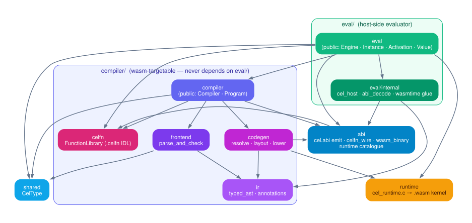

# System architecture

celwasmc compiles a CEL expression to a sandboxed `.wasm` artifact once, then evaluates those exact bytes anywhere at native speed. This page covers the four-role lifecycle, the link-mode fork, the data contracts between roles, and the threading model.

Two workloads drive the design:

- **Security-critical.** An expression you don't fully trust (a fraud rule, a customer-authored policy) over data you do. A `Program` runs in a bounded, syscall-free WebAssembly sandbox: it sees only the variables you marshal in, and its failure modes are *values*, never escapes or crashes.
- **Lightweight edge.** Per-request decisions in an Envoy filter or gateway hop. A static `Program` is one self-contained artifact — JIT-compiled once at `Plan`, native code per `Eval`, byte-identical on every node.

```
            ┌─────────────┐                       ┌──────────────┐
  CEL  ───► │  Compiler   │ ─── Program (bytes) ──►│   Engine     │──► Value
  source    │ (compile    │      .wasm + cel.abi   │  (eval time, │
  + decls   │  time)      │   ↓ ship / store / send  any host,    │
            └─────────────┘     across time,        many nodes)   │
                                process, machine    └──────────────┘
   one compile  ───────────────────────────────────►  many evals, anywhere
```

The two phases separate in **time, process, and machine**. A Program is plain bytes carrying everything the evaluator needs: compile on a build server, evaluate in a process that never links the compiler — or in a browser tab over pure TypeScript (`bindings/`).

Byte-level detail lives in [`03-abi-and-memory.md`](03-abi-and-memory.md); compiler and evaluator internals in [`01-compiler.md`](01-compiler.md) and [`02-evaluator.md`](02-evaluator.md). Section 6 maps the doc set.

## 1. Problem and goals

celwasmc is an ahead-of-time compiler from CEL (`doc/langdef.md`) to WebAssembly, paired with a host-side evaluator built on wasmtime. `Compile` turns CEL source plus declarations into a self-describing wasm module (a `Program`); `Eval` runs it against per-call bindings (an `Activation`) and produces a `Value`.

Scope decisions:

- **Static subset only.** `dyn`-typed expressions are rejected at the frontend (the RejectDyn gate, `compiler/frontend/parse_and_check.cc`), with a few carve-outs listed in `01-compiler.md`. No runtime type dispatch in the general case.
- **cel-cpp is reused, not reimplemented.** Parsing and type-checking wrap the vendored `third_party/cel-cpp` parser and checker; its overload ids, error messages, and canonical forms are the contract our output is conformance-scored against (`spec/tests/`, the oracle in `testdata/cel_cpp_oracle_test.cc`).
- **The wasm runtime kernel is language-agnostic C.** `runtime/cel_runtime.c` and siblings compile to both `cel_runtime.wasm` (wasm32-wasi-threads) and a native twin used by unit tests (`04-runtime.md`).

Standing design goals:

1. **Codegen is a pure translation** — given the per-node annotation table plus the frozen overload table, emitting wasm is a switch on node kind.
2. **One per-node fact table** — every expr id has a `NodeAnnotation` (`compiler/ir/annotations.h`, 12 fields today); no parallel tables.
3. **Per-instance memory isolation** — two Instances share no linear-memory state; each `Engine::Plan` gets a fresh store and memory.
4. **Literals live in rodata, unconditionally** — no cap, no runtime-initialised fallback (`compiler/codegen/static_memory_builder.{h,cc}` is infallible by design).
5. **Testable in layers** — each pass and each kernel is unit-testable in isolation (`06-testing-strategy.md`).
6. **Operator lookup is a flat table** — every overload is one entry in the `OverloadTable` (`compiler/codegen/overload_table.cc`, 271 built-in seeds); adding a helper is one seed row, never an emitter edit.

## 2. Roles and lifecycle


```
Compiler  --Compile(source, opts)-->  Program          (compile time)
Engine    --Plan(program)---------->  Instance         (run time)
Instance  --Eval(activation)------->  Value
```

**`celwasm::Compiler`** (`compiler/compiler.h`) — variable declarations plus function libraries, built via `Compiler::Builder`. Copyable pure data with no wasmtime dependency; `//compiler/...` carries no eval-side dep by standing rule, keeping `compiler.wasm` reachable as a future build target. One Compiler mints many Programs via `Compile(source, CompilerOptions)` (`compiler/internal/compile.cc`; the pipeline is `01-compiler.md`).

**`celwasm::Program`** (`compiler/program.h`) — pure data: a `std::vector<uint8_t>` of wasm bytes with an embedded `cel.abi` custom section, behind `wasm_bytes()`. No handles, no wasmtime state, no validation at construction — wasm parsing happens at `Engine::Plan`. (A design where Program held compiler-owned wasmtime state was rejected as role conflation.) Pure bytes make Program a serialization boundary and keep the Compiler/Engine edges one-directional; both speak only `shared/`.

**`celwasm::Engine`** (`eval/engine.h`) — the process-shared machinery: one `wasm_engine_t` (tail calls, threads, shared memory enabled) plus the parsed `cel_runtime.wasm` module, in a `shared_ptr<WasmtimeEngineState>`. Caching the parsed runtime module is bench-justified (~34x per-Plan). The Engine also carries the registration surfaces — `Use` (self-describing plugin artifacts, with a static export check at registration), `AddFunction` / `AddTypedFunction` / `BindFunction` (host callbacks), and the `AddPlugin` explicit-decls escape hatch (`02-evaluator.md`, `05-custom-functions.md`). At `Plan`, every custom function a Program's `cel.abi` records as required is verified against that registry (existence + exact signature), and only the plugins the Program calls are instantiated.

**`Engine::Plan(const Program&)`** produces an **`Instance`** (`eval/instance.h`): a fresh store, linker, instantiated module(s), a cloned handle to the runtime's shared memory, the `eval` export, and the decoded ABI. `Eval(activation)` marshals bindings into guest memory, calls `$eval`, and decodes the result into a host-owned `Value`. An Instance holds the engine state `shared_ptr`, so it outlives the Engine handle that minted it (pinned by `EnginePlanTest.InstanceOutlivesEngineAndCompilerWithEvalProof`).

The lifecycle is strictly forward: Compiler never sees an Engine, Engine never sees CEL source, Instance never sees declarations except through the `cel.abi` bytes.

## 3. Link modes


`CompilerOptions::link_mode` (`compiler/compiler.h`) selects how a Program relates to the runtime kernel:

- **`kStatic` (default).** Self-contained: the compiler adopts the wrapper-stripped runtime module as its base (`BinaryenModuleRead` over embedded stripped-runtime bytes, `compile.cc::AdoptStrippedRuntime`), installs the expression's rodata segment, and lowers `$eval` into the adopted module. The Program defines its own memory, has **zero** `"cel"`-namespace function imports (pinned by `compile_test.cc`), and retains only host-boundary imports (`cel_host.*`, `cel_env.*`, `cel_fn.*`). Size ~800 KB–1.1 MB.
- **`kDynamic` (opt-in).** A thin expression module (~10 KB) that imports `cel.memory` and the full `cel.*` helper surface from a separately-instantiated `cel_runtime.wasm`. At Plan, the engine instantiates the runtime first, then defines every runtime export on the linker from `abi::CelRuntimeHelpers()` — the same generated catalogue codegen's import pass uses, so the two sets cannot drift.

Both arms share one codegen path: `LowerExportAndFinalise` (`compile.cc`) is the single tail — overload-table build, import installation, lowering, export, `cel.abi` attach, validate→optimize→serialize. One codegen path, two bootstraps, so the arms cannot silently diverge.

Static is the default because it measured as the performance-dominant shape (no cross-module call overhead, whole-module optimization across the expr/kernel boundary). `kDynamic` remains right when Program size or one-runtime-many-exprs sharing dominates; the e2e suite compiles its corpus under both (`e2e/link_mode_e2e_test.bzl`).

**Routing is by import introspection, not label.** `Engine::Plan` compiles the expr module before instantiation and decides `is_static = !ModuleImportsCelNamespace(module)` (`eval/engine.cc`). The `link_mode` label in `cel.abi` is metadata and a corruption **tripwire only**: when present it is cross-checked against the import-derived answer; unknown future values are tolerated. A stale label can never misroute a Program, and label-less synthetic modules still plan (`EnginePlanLinkModeTripwireTest`, 4 cases).

The expr module's `cel.memory` import declares exactly `MemoryLayout::kInitialMemoryPages`, the runtime's own exported size — held in lockstep by a `static_assert`. There is no embedder knob for it: a `mem_size_bytes` option existed until 2026-07-25 but was inert under `kStatic` and broke instantiation under `kDynamic` whenever it was raised, so it was deleted.

!!! note "Open questions"
    **V8/R72 — resolved 2026-07-25.** Probed: under `kStatic` the knob was byte-for-byte a no-op; under `kDynamic`, any value above the runtime's 5 exported pages failed Plan with `incompatible import type for cel::memory`. Having no useful setting, the option, the CLI flag, and the vestigial `LoweringOptions` field were deleted.

    **V25:** the three LinkMode enums (public option, internal option, `cel.abi` proto label) are forwarded by blind `static_cast` with nothing locking their values together. A `static_assert` pin is pending.

## 4. The data contracts at a glance


Four contracts connect the roles; the byte-level telling is [`03-abi-and-memory.md`](03-abi-and-memory.md).

**Program bytes.** A complete wasm module exporting `eval`. Validation is deferred: the constructor accepts any bytes; malformed wasm surfaces as a status error at `Engine::Plan`. The module's low 8 KiB of linear memory (`CELWASM_RESERVED_LOW_MEMORY_BYTES`, `runtime/cel_layout.h`) is the expression's static region — rodata plus workspace slots — gated twice: `ValidateExprStaticRegion` rejects an oversized layout at Compile (both link modes), and `ValidateAbiSlotExtents` re-checks the declared slot extents at Plan. A Program that would overrun runtime statics is rejected before it runs.

**`cel.abi`.** A custom section carrying a `celwasm.abi.CelAbi` proto: declared variables (name, wire repr, workspace slot), interned attributes for partial evaluation, proto field references, the link-mode label. The engine decodes it off the raw bytes — no wasmtime state — and tolerates its absence (synthetic WAT fixtures plan with an empty abi). It is the only channel through which compile-time declarations reach the evaluator.

**Activation.** A name→`Value` map (`eval/activation.h`) bound per Eval. The Instance marshals each ABI-declared variable into its workspace slot with strict kind checking plus three deliberate coercions (null into scalar slots, WKT wrapper peel, Timestamp/Duration peel — the checker is the strictness gate, per langdef wrapper semantics). `PartialEval(activation, patterns)` additionally stamps pattern-matched variables UNKNOWN; a pattern wins over a present binding.

**Value.** A kind-tagged variant (`eval/value.h`) owning its payload. Decoded results are deep-copied out of guest memory because the backings are per-Eval; a `Value` is safe to hold across Evals and Instances. Its `StructurallyEquals` is identity-based for aggregates — deliberately not CEL spec equality.

Four kind-like enums coexist by design: `ir::Repr` (compiler IR), `shared::CelType`'s kind (public declarations), the wire `CelKind` (`runtime/cel_data.h`), and `Value::Kind` (decoded results). They agree on the scalar range and deliberately diverge above it; all conversion is by explicit switch, never a cast. The single sanctioned cast-equivalence is `eval::ErrorCode` ↔ the wire `CEL_ERR_*` codes. `03-abi-and-memory.md` carries the alignment table.

!!! note "Open question (V6)"
    `ir::Repr` uses implicit enum numbering while the wire format promises stability; a mid-enum insertion would silently renumber every emitted repr. Explicit initializers + a pin test are pending.

## 5. Threading model

| Stage | Contract |
|---|---|
| `Compiler` | Copyable pure data; `Compile` is reentrant **except** when `optimize_level > 0` (see below). |
| `Program` | Immutable bytes; freely shareable across threads and processes. |
| `Engine` setup | `Add*`/`Bind*` registration is single-threaded: configure once, then share. |
| `Engine::Plan` | Concurrent-safe; each call builds a fresh store/linker/memory and shares only the thread-safe `wasm_engine_t` + parsed runtime module. |
| `Instance` | Thread-owned, single-threaded; bind one per worker. Outlives the Engine via the `shared_ptr` chain. |

**Compiler-side hazard.** Binaryen's optimizer configuration is process-global state (`BinaryenSetOptimizeLevel` / `BinaryenSetShrinkLevel`; see `compiler/codegen/module.h` `WasmModule::Optimize`). Compiler is copyable pure data, so two threads compiling with `optimize_level > 0` race on the global even through two distinct Compilers. The contract: **serialize `Compile` calls process-wide whenever `optimize_level > 0`**; the default level 0 never touches the globals. The structural fix (per-module `BinaryenModuleRunPasses`) is future work in `01-compiler.md`.

Eval-side details that make the contract hold: host-callback registration stores callbacks in a `std::map` for node-address stability (the wasmtime trampoline env captures `&callback`; later insertions must not move it); concurrent Plan is test-pinned (`ConcurrentPlanCallsAllSucceed`), as is Instance-outlives-Engine. The runtime's linear memory is `shared` (a wasm32-wasi-threads artifact requirement), but cross-thread eval is not used — isolation comes from one Instance per thread, each with its own memory.

## 6. Doc map and repo layout

Reader path: 00 → 01/02 → 03/04/05 → 06/07.

| Doc | Subject |
|---|---|
| `00-architecture.md` | This doc — roles, lifecycle, link modes, contracts, threading. |
| [`01-compiler.md`](01-compiler.md) | The pass pipeline: parse/check → resolve → layout → lower → finalize. |
| [`09-lowering.md`](09-lowering.md) | Codegen: per-node lowering arms and the two link-mode bootstraps. |
| [`02-evaluator.md`](02-evaluator.md) | Plan/instantiate/eval lifecycle; registration; host-call dispatch; marshal and decode. |
| [`03-abi-and-memory.md`](03-abi-and-memory.md) | The value model: CelValue layout, calling convention, memory map, arena. |
| [`08-abi-wire-format.md`](08-abi-wire-format.md) | The wire descriptors: `cel.abi`, runtime catalogue, errors/unknowns, plugin boundary. |
| [`04-runtime.md`](04-runtime.md) | The runtime kernel: build topology, kernel conventions, aggregates, arena. |
| [`05-custom-functions.md`](05-custom-functions.md) | The `.celfn` subsystem across compiler/eval/tools. |
| [`06-testing-strategy.md`](06-testing-strategy.md) | The layer pyramid, gates, disciplines, coverage ledger. |
| [`07-benchmarking.md`](07-benchmarking.md) | Measurement boundaries, production-config rules, the comparative harness. |

Repo layout, by lifecycle role (the cel-cpp convention):



- `compiler/` — CEL source → Program. Children: `frontend/` (parse + type-check, wraps cel-cpp), `ir/` (typed AST + annotations), `codegen/` (Binaryen lowering), `celfn/` (function library), `internal/` (the `compile.{h,cc}` facade). Public face: `compiler.{h,cc}` + `program.h`. Never depends on `eval/` or wasmtime.
- `eval/` — Program + Activation → Value. Public leaves: `engine`, `instance`, `activation`, `value`, `error`, `attribute`, `host_call_context`, `typed_function`; `host/` and `internal/` (wasmtime glue, `abi_decode`, `cel_host`) are private.
- `shared/` — `CelType`, the type vocabulary both phases speak.
- `abi/` — the wire-contract layer: `cel.abi` emit, the generated runtime catalogue, the public `Plugin` artifact (`abi/plugin.h` — both `Compiler::Builder::Use` and `Engine::Use` take it, so it sits below both roles), and `wasm_binary` (the only first-party code allowed to know wasm binary framing); `abi/wit/` holds the plugin-boundary vocabulary.
- `runtime/` — the C kernel, twice-compiled: `cel_runtime.wasm` and the native twin.
- `bazel/` — first-party Starlark, incl. `gen_runtime_catalogue`.
- `tools/` (the `cel` CLI, `wat_runner`), `conformance/`, `e2e/`, `benchmark/`, `testdata/`, `examples/` — leaf binaries and tests.
- `spec/` — the vendored cel-spec conformance corpus; `third_party/` — cel-cpp (fetched on demand), Binaryen, wasmtime, wasi-sdk.

Bazel visibility enforces the architecture at analysis time: the public API is a curated target set (`//compiler:{compiler,program}`, the eval leaves above, `//shared:type`, `//abi:*`, `//runtime:*`); everything else is scoped to the first-party `//:internal` package group, so a dependency edge that violates the role split fails the build.
