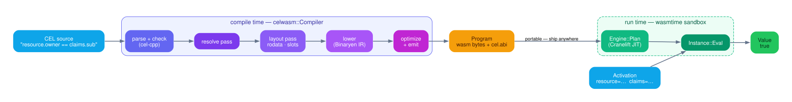
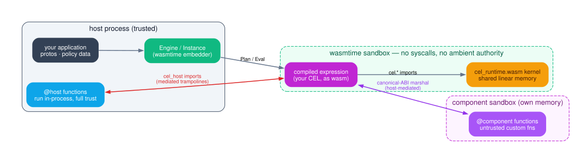

# System architecture

Status: current — authored 2026-06-10 from the design-rebuild notes
(doc/design/notes/). Supersedes: doc/implementation-plan/rewrite/design.md,
two-phase-runtime-isolation.md, m28-configurable-linking.md (architecture
content; those docs remain as history).

Start with the one-sentence version: **we compile a CEL expression to a
sandboxed `.wasm` artifact once, then evaluate those exact bytes
anywhere at native speed.** Everything in this doc is in service of that
sentence — and of the two kinds of workload it's built for.

**The security-critical case.** You are running an expression you don't
fully trust on data you very much do — a fraud rule in a payments path,
an entitlement check authored by a customer, a transaction-limit policy
in a regulated system. You want it evaluated at native speed, but you
cannot let it read host memory, reach the network or disk, or hang the
process. A cel-wasm `Program` runs in a bounded, syscall-free WebAssembly
sandbox: it sees only the variables you marshal in, and the worst a
hostile expression can do is return the wrong `Value` or an error — never
escape. The expression's failure modes are *values*, not crashes.

**The lightweight-edge case.** You are an Envoy filter, an API-gateway
hop, a per-request routing or rate-limit decision — thousands of times a
second, on every node. You want one tiny, deterministic artifact you
compile once and run byte-for-byte identically everywhere, with no
per-host interpreter to drift and no AST walk on the hot path. A static
`Program` is exactly that: self-contained wasm, JIT-compiled once at
`Plan`, then native code per `Eval`.

```
            ┌─────────────┐                       ┌──────────────┐
  CEL  ───► │  Compiler   │ ─── Program (bytes) ──►│   Engine     │──► Value
  source    │ (compile    │      .wasm + cel.abi   │  (eval time, │
  + decls   │  time)      │   ↓ ship / store / send  any host,    │
            └─────────────┘     across time,        many nodes)   │
                                process, machine    └──────────────┘
   one compile  ───────────────────────────────────►  many evals, anywhere
```

The two phases are separable in **time, process, and machine**: a
Program is plain bytes and carries everything the evaluator needs, so you
can compile on a build server and evaluate in a process that never links
the compiler — or in a browser tab, where the eval side is pure
TypeScript over the same bytes (`bindings/`).

This is the entry point of the design-doc set. It states the problem,
the four-role lifecycle, the link-mode fork, the data contracts the
roles exchange, and the end-to-end threading model. Byte-level detail
(slot layout, the memory map, the `cel.abi` schema) lives in
`03-abi-and-memory.md`; the compiler and evaluator internals live in
`01-compiler.md` and `02-evaluator.md`. Section 6 maps the full set.

## 1. Problem and goals

celwasmc is an ahead-of-time compiler from CEL (the Common Expression
Language, `doc/langdef.md`) to WebAssembly, paired with a host-side
evaluator built on wasmtime. The compile step turns CEL source plus
variable/function declarations into a self-describing wasm module (a
`Program`); the eval step instantiates that module and evaluates it
against per-call variable bindings (an `Activation`), producing a
`Value`. The separability that makes this worth doing — Program as a
plain-bytes boundary across time, process, and machine — is the lede
above; the rest of this doc is how the pieces hold that contract.

Scope decisions that bound the whole system:

  - **Static subset only.** The compiler accepts statically-typed CEL;
    `dyn`-typed expressions are rejected at the frontend (the RejectDyn
    gate, `compiler/frontend/parse_and_check.cc`), with a small set of
    deliberate admit carve-outs documented in `01-compiler.md`. There
    is no runtime type dispatch in the general case.
  - **cel-cpp is reused, not reimplemented.** Parsing and type-checking
    wrap the vendored `third_party/cel-cpp` parser and checker; its
    overload ids, error messages, and canonical forms are the contract
    our output is conformance-scored against (the corpus under
    `spec/tests/`, the oracle in `testdata/cel_cpp_oracle_test.cc`).
  - **The wasm runtime kernel is language-agnostic C.**
    `runtime/cel_runtime.c` and siblings compile to both
    `cel_runtime.wasm` (wasm32-wasi-threads) and a native twin used by
    unit tests (`04-runtime.md`).

Standing design goals, carried forward from the original rewrite
design (the still-true subset of its §2):

  1. **Codegen is a pure translation.** Given a fully-populated
     per-node annotation table plus the frozen overload table,
     emitting wasm is a switch on node kind — no decision-making, no
     allocation choices, no type-based helper-name derivation in the
     emitter.
  2. **One per-node fact table.** Every expr id in the checked AST has
     a `NodeAnnotation` (`compiler/ir/annotations.h`) populated with
     the fields its kind cares about; fields irrelevant to a kind stay
     at a zero sentinel. No parallel tables. The schema grew from the
     original sketch (it is 12 fields today) but the no-parallel-tables
     invariant held across the project's lifetime.
  3. **Per-instance memory isolation.** Two Instances share no
     linear-memory state; each `Engine::Plan` produces a fresh store
     and memory.
  4. **Literals live in rodata, unconditionally.** Every constant
     lands in the module's data segment; there is no cap, no fallback,
     no runtime-initialised-literal variant
     (`compiler/codegen/static_memory_builder.{h,cc}` has an
     infallible API by design).
  5. **Testable in layers.** Each pipeline pass and each runtime
     kernel is unit-testable in isolation; integration tests are an
     additional layer, not a substitute (`06-testing-strategy.md`).
  6. **Operator lookup is a flat table.** Every CEL overload —
     built-in or custom — is one entry in the `OverloadTable`
     (`compiler/codegen/overload_table.cc`, 271 built-in seeds today);
     adding a helper is one seed row, never an emitter edit.

## 2. Roles and lifecycle



The system has exactly four roles, two per phase:

```
Compiler  --Compile(source, opts)-->  Program          (compile time)
Engine    --Plan(program)---------->  Instance         (run time)
Instance  --Eval(activation)------->  Value
```

**`celwasm::Compiler`** (`compiler/compiler.h`) is pure compile-time
state: variable declarations plus function libraries, built via
`Compiler::Builder`. It is copyable pure data with no wasmtime
dependency — `//compiler/...` carries no eval-side dep by standing
rule, which keeps `compiler.wasm` reachable as a future build target
(the compiler itself can be cross-compiled to wasm and run where no
native toolchain exists). One Compiler mints many Programs.
`Compile(source, CompilerOptions)` runs the internal pass pipeline
(`compiler/internal/compile.cc`; the pipeline is `01-compiler.md`'s
subject) and returns a `Program`.

**`celwasm::Program`** (`compiler/program.h`) is pure data: a
`std::vector<uint8_t>` of wasm bytes with an embedded `cel.abi` custom
section, behind `wasm_bytes()`. Nothing else. No handles, no wasmtime
state, no validation at construction — wasm parsing happens at
`Engine::Plan`. This is deliberate: an earlier design had Program hold
a `shared_ptr` to compiler-owned wasmtime state and Instance hold a
back-reference to its Program; it was rejected mid-execution as role
conflation. Pure bytes make the Program a serialization boundary —
compile on a build server, ship the bytes, evaluate anywhere — and
keep the Compiler/Engine dependency edges one-directional (neither
links the other; both speak `shared/`).

**`celwasm::Engine`** (`eval/engine.h`) owns the process-shared
execution machinery: one `wasm_engine_t` (tail calls, threads, and
shared memory enabled — the runtime is a wasm32-wasi-threads build
using `musttail` dispatch) plus the parsed `cel_runtime.wasm` module,
held in a `shared_ptr<WasmtimeEngineState>`. Caching the parsed
runtime module on the Engine is bench-justified (~34x per-Plan).
The Engine also carries the embedder registration surfaces — foreign
modules (`AddModule`), host callbacks (`AddFunction` /
`AddTypedFunction` / `BindFunction`), and Component-Model components
(`AddComponent`) — described in `02-evaluator.md` and
`05-custom-functions.md`.

**`Engine::Plan(const Program&)`** produces an **`Instance`**
(`eval/instance.h`): a fresh store, linker, instantiated module(s), a
cloned handle to the runtime's exported shared memory, the `eval`
export, and the decoded ABI. The Instance is the live evaluator:
`Eval(activation)` marshals bindings into guest memory, calls `$eval`,
and decodes the result slot into a host-owned `Value`. An Instance
holds the engine state `shared_ptr`, so it outlives the Engine handle
that minted it (pinned by
`EnginePlanTest.InstanceOutlivesEngineAndCompilerWithEvalProof`).

The lifecycle is strictly forward: Compiler never sees an Engine,
Engine never sees CEL source, Instance never sees declarations except
through the `cel.abi` bytes. Each arrow in the diagram is a data
contract, catalogued in §4.

## 3. Link modes

The one top-level architectural fork is how a Program relates to the
runtime kernel. `CompilerOptions::link_mode` selects it
(`compiler/compiler.h`):

**`kStatic` (the default).** The Program is self-contained: the
compiler adopts the wrapper-stripped runtime module as its base
(`BinaryenModuleRead` over embedded stripped-runtime bytes,
`compile.cc::AdoptStrippedRuntime`), installs the expression's rodata
segment into it, and lowers `$eval` directly into the adopted module.
The Program defines its own memory, has **zero** `"cel"`-namespace
function imports (the load-bearing shape invariant, pinned by
`compile_test.cc`), and retains only host-boundary imports
(`cel_host.*`, `cel_env.*`, `cel_fn.*`). Size is ~800 KB–1.1 MB.

**`kDynamic` (opt-in).** The Program is a thin expression module
(~10 KB) that imports `cel.memory` and the full `cel.*` helper surface
from a separately-instantiated `cel_runtime.wasm`. At Plan, the engine
instantiates the runtime first, then defines every runtime export on
the linker from `abi::CelRuntimeHelpers()` — the same generated
catalogue codegen's import pass uses, so the import set and the bind
set cannot drift.

Both arms share one codegen path: `LowerExportAndFinalise`
(`compile.cc`) is the single tail of both — overload-table build,
import installation (self-skipping names already defined in an adopted
runtime), lowering, export, `cel.abi` attach, then
validate→optimize→serialize. One codegen path, two bootstraps, so the
arms cannot silently diverge.

**Routing is by import introspection, not by label.** `Engine::Plan`
compiles the expr module before instantiation and decides
`is_static = !ModuleImportsCelNamespace(module)` (`eval/engine.cc`).
The `link_mode` field stamped into `cel.abi` is embedder-tooling
metadata and a corruption **tripwire only**: when present it is
cross-checked against the import-derived answer, and unknown future
label values are tolerated (open wire set). A stale or wrong label can
therefore never misroute a Program, and label-less synthetic modules
still plan. The four `EnginePlanLinkModeTripwireTest` cases pin this.

**Why the recommendation flipped.** The original design explicitly
recommended *against* inlining the runtime into the expr module
("Recommend: not in this rewrite"): small Programs, a stable
import-based shape, and no duplicated kernel bytes per expression.
That reasoning lost to measurement — the self-contained module is the
performance-dominant shape (no cross-module call overhead, whole-
module optimization across the expr/kernel boundary), and the
production default should not require opt-in. The old argument still
governs `kDynamic`, which remains the right choice when Program size
or one-runtime-many-exprs sharing dominates; both modes are
first-class and the e2e suite compiles its corpus under each
(`e2e/link_mode_e2e_test.bzl`).

Compile-time consequences of the fork that embedders see:

  - `CompilerOptions::mem_size_bytes` sizes the imported `cel.memory`
    in `kDynamic`; under the default `kStatic` it is a no-op (the
    adopted runtime defines its own memory and the arena is sized at
    runtime).

> **Open question (V8/R72):** in `kDynamic`, `mem_size_bytes` above
> 256 KiB stamps an import minimum larger than the runtime's exported
> memory and plausibly fails instantiation at Plan; the compile side
> and engine side were never reconciled. Probe pending; the knob may
> be deleted end-to-end.

> **Open question (V25):** the three LinkMode enums (public
> `CompilerOptions::LinkMode`, internal `CompileOptions::LinkMode`,
> the `cel.abi` proto label) are forwarded by blind `static_cast` with
> nothing locking their values together; a mode added to one enum only
> would miscompile silently. A `static_assert` pin is pending.

## 4. The data contracts at a glance



Four contracts connect the roles. Each gets one paragraph here; the
byte-level telling is `03-abi-and-memory.md`.

**Program bytes.** A complete wasm module exporting `eval` (export
name configurable at compile time). Validation is deferred: the
constructor accepts any bytes, and malformed wasm surfaces as a
status error at `Engine::Plan`. The module's low 8 KiB of linear
memory (`CELWASM_RESERVED_LOW_MEMORY_BYTES`, `runtime/cel_layout.h`)
is the expression's static region — rodata plus workspace slots — and
is gated twice: `ValidateExprStaticRegion` rejects an oversized layout
at Compile (both link modes), and `ValidateAbiSlotExtents` re-checks
the declared slot extents at Plan, so a Program that would overrun
runtime statics is rejected before it runs rather than corrupting
memory.

**`cel.abi`.** A custom section carrying a `celwasm.abi.CelAbi` proto:
the declared variables (name, wire repr, workspace slot), interned
attributes for partial evaluation, proto field references, and the
link-mode label of §3. The engine decodes it straight off the raw
bytes — no wasmtime state needed — and tolerates its absence
(synthetic WAT fixtures plan with an empty abi). It is the only
channel through which compile-time declarations reach the evaluator.

**Activation.** A name→`Value` map (`eval/activation.h`) bound per
Eval call. The Instance marshals each ABI-declared variable into its
workspace slot, with strict kind checking plus three deliberate
coercions (null into scalar slots, WKT wrapper peel, Timestamp/
Duration peel — the checker is the strictness gate, per langdef
wrapper semantics). `PartialEval(activation, patterns)` additionally
stamps pattern-matched variables as UNKNOWN, pattern winning over a
present binding.

**Value.** A kind-tagged variant (`eval/value.h`) owning its payload.
Decoded results are deep-copied out of guest memory because the
backings are per-Eval (cleared on externref-table reset and
`arena_reset`); a `Value` is therefore safe to hold across Evals and
Instances. Its equality (`StructurallyEquals`) is identity-based for
aggregates — deliberately not CEL spec equality.

A note on enums, because four kind-like enums coexist by design:
`ir::Repr` (compiler IR), `shared::CelType`'s kind (public
declarations), the wire `CelKind` (`runtime/cel_data.h`), and
`Value::Kind` (decoded results). They agree on the scalar range and
deliberately diverge above it; all conversion is by explicit switch,
never a cast — the single sanctioned cast-equivalence is
`eval::ErrorCode` ↔ the wire `CEL_ERR_*` codes. `03-abi-and-memory.md`
carries the alignment table.

> **Open question (V6):** `ir::Repr` uses implicit enum numbering
> while the wire format promises stability; nothing pins the numeric
> values, so a mid-enum insertion would silently renumber every
> emitted repr. Explicit initializers + a pin test are pending.

> **Resolved (V2–V4, 2026-06-10):** the error and unknown *payload*
> contracts each have ONE crowned telling in `03-abi-and-memory.md`
> §8: bare-code errors (V4, fixed), per-op-class 3VL precedence
> (V3, fixed — error dominates for strict ops, unknown dominates
> for `&&`/`||`; §8.3 scope note), and the UnknownSet
> **descriptor-offset** shape for `payload.unk` (V2 — fixed: host
> writers mint descriptors, decoders dereference, `Value::Unknown`
> carries the merged attribute-id set). This doc still says
> nothing byte-level about them; §8 there is the telling.

## 5. Threading model, end to end

The contract per stage — including the compiler half, which prior docs
left untold:

| Stage | Contract |
|---|---|
| `Compiler` | Copyable pure data; `Compile` is reentrant **except** when `optimize_level > 0` (see below). |
| `Program` | Immutable bytes; freely shareable across threads and processes. |
| `Engine` setup | `Add*`/`Bind*` registration is single-threaded: configure once, then share. |
| `Engine::Plan` | Concurrent-safe; each call builds a fresh store/linker/memory and shares only the thread-safe `wasm_engine_t` + parsed runtime module. |
| `Instance` | Thread-owned, single-threaded; bind one per worker. Outlives the Engine via the `shared_ptr` chain. |

**The compiler-side hazard.** Binaryen's optimizer configuration is
process-global state (`BinaryenSetOptimizeLevel` /
`BinaryenSetShrinkLevel`; see the caveat on
`compiler/codegen/module.h` `WasmModule::Optimize`). That header's
own mitigation claim — "serialised by `celwasm::Compiler` ownership" —
is false: Compiler is copyable pure data and one-Compiler-many-
Programs is the documented pattern, so two threads compiling with
`optimize_level > 0` race on the global even through two *distinct*
Compilers. The contract is therefore: **serialize `Compile` calls
process-wide whenever `optimize_level > 0`** (the default level 0
never touches the globals and is safe). The structural fix —
per-module `BinaryenModuleRunPasses` instead of the global setter —
is recorded as future work in `01-compiler.md`.

On the eval side, two details make the documented contract hold
rather than merely being asserted:

  - Host-callback registration stores callbacks in a `std::map`
    precisely for node-address stability — the wasmtime trampoline env
    captures `&callback`, and later insertions must not move it.
  - Concurrent Plan is test-pinned (`ConcurrentPlanCallsAllSucceed`),
    as is Instance-outlives-Engine; neither is a comment-only promise.

The runtime's linear memory is `shared` (a wasm32-wasi-threads
artifact requirement), but sharing is not used for cross-thread eval:
isolation comes from one-Instance-per-thread, each with its own
memory.

## 6. Map of the doc set, and the repo by lifecycle role

The design-doc set under `doc/design/` (reader path: 00 → 01/02 →
03/04/05 → 06/07):

| Doc | Subject | Status |
|---|---|---|
| `00-architecture.md` | This doc — roles, lifecycle, link modes, contracts, threading. | current |
| `01-compiler.md` | The pass pipeline: parse/check → resolve → layout → lower → finalize, each pass as a contract. | current |
| `02-evaluator.md` | Plan/instantiate/eval lifecycle; registration surfaces; host-call dispatch; marshal and decode. | current |
| `03-abi-and-memory.md` | The wire contracts: CelValue layout, the memory map, `cel.abi`, the error/unknown contract. | current |
| `04-runtime.md` | The runtime kernel: build topology, kernel conventions, aggregates, arena. | current |
| `05-custom-functions.md` | The `.celfn` subsystem across compiler/eval/tools; the `@native` fork decision. | current |
| `06-testing-strategy.md` | The layer pyramid, gates, disciplines, coverage ledger. | current |
| `07-benchmarking.md` | Measurement boundaries, production-config rules, the comparative harness. | current |

Repo layout, organised by lifecycle role (the cel-cpp convention):


  - `compiler/` — compile-time: CEL source → Program. Children:
    `frontend/` (parse + type-check, wraps cel-cpp), `ir/` (typed AST
    + annotations), `codegen/` (Binaryen lowering), `celfn/` (function
    library), `internal/` (the `compile.{h,cc}` pipeline facade).
    Public face: `compiler.{h,cc}` + `program.h`. Never depends on
    `eval/` or wasmtime.
  - `eval/` — eval-time: Program + Activation → Value. Public leaves
    `engine`, `instance`, `activation`, `value`, `error`, `attribute`,
    plus `host_call_context` and `typed_function` (structurally
    public: `engine.h` includes both); `host/` and `internal/`
    (wasmtime glue, `abi_decode`, `cel_host`) are private.
  - `shared/` — `CelType`, the type vocabulary both phases speak.
    `compiler/` and `eval/` both depend on it; neither depends on the
    other.
  - `abi/` — the `cel.abi` wire contract (emit and parse) plus the
    generated runtime catalogue; `abi/wit/` holds the component-
    boundary vocabulary.
  - `runtime/` — the C kernel, twice-compiled: `cel_runtime.wasm` and
    the native twin.
  - `bazel/` — first-party Starlark and the catalogue generator
    (`gen_runtime_catalogue`).
  - `tools/` (the `cel` CLI, `wat_runner`), `conformance/`, `e2e/`,
    `bench/` + `benchmark/`, `testdata/`, `examples/` — leaf binaries
    and tests.
  - `spec/` — the vendored cel-spec conformance corpus;
    `third_party/` — cel-cpp (fetched on demand), Binaryen, wasmtime,
    wasi-sdk.

Visibility enforces the architecture at analysis time: the public API
is a curated set of Bazel targets (`//compiler:{compiler,program}`,
the eval leaves above, `//shared:type`, `//abi:*`, `//runtime:*`);
everything else is scoped to the first-party `//:internal` package
group, so a dependency edge that violates the role split fails the
build rather than a review.

<!-- diagram-wanted: lifecycle sequence diagram — one Compile, two
     concurrent Plans, per-thread Eval loops, showing which objects
     are shared vs per-thread (would carry §5 visually) -->

## History

This doc supersedes the architecture content of:

  - `doc/implementation-plan/rewrite/design.md` — the rewrite design
    baseline (self-declared historical); its still-true goals are
    restated in §1, its memory-model and pipeline content is carried
    by `01-compiler.md` and `03-abi-and-memory.md`.
  - `doc/implementation-plan/rewrite/two-phase-runtime-isolation.md` —
    the Compiler/Program/Engine/Instance split; §2 here is the
    as-shipped telling (the doc's Program-holds-wasmtime-state
    sections describe a rejected intermediate shape).
  - `doc/implementation-plan/rewrite/m28-configurable-linking.md` —
    the link-mode fork; §3 here is the as-shipped telling (the doc's
    early sections predate the static-default flip).

Those files remain in place as dated history with archive banners
pointing here.
