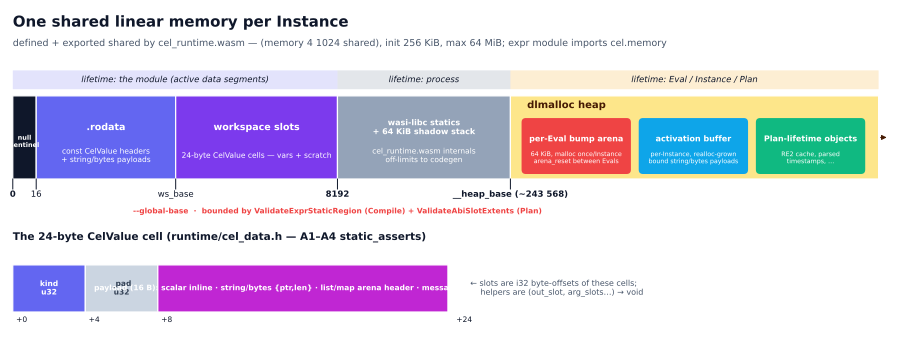

# Compiler design — the pass pipeline

Status: current — authored 2026-06-10 from the design-rebuild notes
plus the post-merge code (slot-allocator free list, static-region
gates). Supersedes: compiler sections of
doc/implementation-plan/rewrite/design.md; memory-layout-design.md
(jointly with 03-abi-and-memory.md); map-list-dispatch.md;
m5-kcall-comprehensions.md and follow-on;
cross-numeric-ordering-plan.md; slice2-control-flow-plan.md;
dyn-passthrough-plan.md.

The compiler is presented as a chain of pass contracts — consumes /
produces / invariant established / breaks-if-reordered — with every
mechanism explained at its spot in the chain. System context (role
split, link-mode fork, threading) is `00-architecture.md`;
byte-level wire facts are `03-abi-and-memory.md`.

## 1. Pipeline overview

`Compiler::Compile(source, CompilerOptions)` (`compiler/compiler.h`)
maps the public options onto the internal `CompileOptions` and calls
the facade `celwasm::Compile` (`compiler/internal/compile.cc`),
which dispatches on `link_mode` and runs the chain below.

| Pass | Consumes | Produces | Invariant established | Breaks if reordered |
|---|---|---|---|---|
| Parse + check (cel-cpp wrap) | source, `CheckOptions` | checked `cel::Ast` (`type_map`, `reference_map`) | every node typed; calls carry resolved overload ids | everything downstream reads `type_map` |
| AST rewrites (×2) | checked AST | enum-constant / type-literal idents become `kConstant` | later passes never see a kIdent for a resolved constant | rewrite 2 keys off "Reference has no value" — must follow rewrite 1 (`parse_and_check.cc:1416-1418`) |
| RejectDyn | rewritten AST | pass/fail | surviving nodes are in the static subset (5 carve-outs, §2.3) | must precede `PopulateAnnotations` so no dyn repr survives except via carve-outs |
| PopulateAnnotations | AST + pool | `WasmAnnotations` seeded (`repr`, `field_number`) → `TypedAst` | every node id has a repr | ResolvePass CHECKs `repr != kUnknown` on idents |
| ResolvePass | `TypedAst` | `ResolveOutput` (annotations, dense variables, intern tables) | locals/scopes/attributes/types/origins/overload ids populated | LayoutPass dereferences `local_index`; lowering dereferences `overload_id` |
| LayoutPass | `TypedAst` + `ResolveOutput` | `StatusOr<StaticLayout>` (rodata, `.storage`, exhaustion gate) | every storage-bearing node has a memory location; rodata+workspace fit the window minus guard | lowering CHECKs `storage.kind` on the paths that need it |
| `ValidateExprStaticRegion` | `StaticLayout` | pass/fail | region end ≤ 8192 in BOTH link modes | kStatic's segment-install CHECK assumes it ran |
| Module bootstrap | link mode | `WasmModule` (fresh+imports, or adopted runtime+rodata) | every call target lowering emits will resolve | `LowerToEvalFunction` requires imports installed first (`expr_lower.h`) |
| `LowerExportAndFinalise` | all of the above | bytes + `cel.abi` | one shared tail for both modes; validate→optimize→serialize | optimizing an unvalidated module mutates unproven IR |

Neither ResolvePass nor LayoutPass mutates the AST; both write only
into the side-table `WasmAnnotations` keyed by expr id. The AST is
mutated exactly twice, by the two frontend rewrites.

## 2. Frontend

Component: `compiler/frontend/parse_and_check.{h,cc}` +
`status_tags.h`; entry point `ParseAndCheck(expression,
CheckOptions) -> absl::StatusOr<TypedAst>`.

### 2.1 Parse + check (cel-cpp wrap)

The checker builder registers unconditionally: standard library,
ComprehensionsV2, strings / encoders / math extensions,
`OptionalCheckerLibrary`, hand-built network decls (`net.IP` /
`net.CIDR` opaque types). Per-call: `container`, variable specs,
custom-fn decls from `CheckOptions::function_libraries`
(cross-library overload-id collision filtering is
`Compiler::Builder::Build`'s contract). One shared `ParserOptions`
(`enable_optional_syntax = true`, `max_recursion_depth = 16384`)
feeds both macro registration and the parse call. Message types
resolve against the process-wide `generated_pool()`; a user schema
merges OVER it via `MergedDescriptorDatabase` — overlay, not
replacement. Check failure is InvalidArgument carrying the
`kUndeclaredReferencesUrl` payload; consumers classify on payloads,
never message substrings (`status_tags.h`).

### 2.2 The two AST rewrites

Both idempotent, both before RejectDyn. (1)
`InlineConstantReferences`: every kIdent whose `reference_map` entry
carries a value (enum constants) becomes a kConstant
(`parse_and_check.cc:1266-1286`). (2)
`InlineTypeIdentifierReferences`: every kIdent whose Reference is
value-less AND whose `type_map` entry is `TypeType(inner)` becomes a
kConstant carrying the spec type name (`SpecTypeName`); MUST follow
rewrite 1 — it keys off "Reference has no value". The rewritten
node's type stays `TypeType(inner)`, so `ReprOf` stamps `Repr::kType`
— the hook the rodata packer dispatches on (§5.2).

### 2.3 RejectDyn — the static-subset gate

A node violates if its `type_map` entry is missing or
`UnacceptableLabel` (`parse_and_check.cc:352-379`) fires: `dyn`,
`error`, function, type-param, and unset specs reject, RECURSIVELY
through list element types, map key/value types, and abstract
parameters — so implicit dyn (bare `[]`, heterogeneous `[1, "two"]`,
`optional<dyn>`) rejects, not just explicit `dyn(...)` (pinned by
`e2e/m4_test.cc`). Five carve-outs ADMIT otherwise-dyn shapes
(`CheckSubsetNode`, cc:611-630), each a narrow shape-matched
predicate:

1. **`dyn(x)` passthrough** — global 1-arg `dyn` admits iff the arg
   is itself a 1-arg `dyn` call or its checker type
   `has_primitive() || has_null() || has_type()`. `dyn` is the
   identity function — no CEL_DYN runtime kind exists; annotations
   and storage forward from the arg, codegen emits the argument
   (§6.1).
2. **Select-through-Any** — a kSelect typed `dyn` admits if its
   operand types as `google.protobuf.Any`, transitively.
3. **`math.@min` / `math.@max`** — the macro expansions admit their
   dyn result; the macro-built mixed-numeric list arg is skipped.
4. **`<target>.format([list-literal])`** — a single kListExpr arg
   admits the args subtree (the renderer dispatches per element
   kind); `list<dyn>` *variables* reject.
5. **`cel.bind` shape** — empty-list-literal iter_range +
   `kConst(false)` loop_condition skips checking the dyn-typed
   iter_range and unreachable loop_step; accu_init / loop_condition
   / result are still checked.

Violations are accumulated, not first-fail: InvalidArgument tagged
`kStaticSubsetViolationUrl`, offending expr ids in the payload. The
public header's gate summary omits the carve-outs (row R11); this
section is authoritative.

> **Open question (V17):** pending frontend probes — reachability
> of the "no type_map entry" arm; non-`cel.bind` expansions vs
> `IsCelBindShape`; a frontend unit test for select-through-Any
> (today e2e-only); `"%s".format([msg_var])`'s clean-runtime-error
> claim; the repr of a wrapper-FQN variable spec.

## 3. IR & annotations

Component: `compiler/ir/typed_ast.{h,cc}` + `annotations.h`.
`TypedAst` is deliberately NOT a heavier IR: a move-only bundle of
`unique_ptr<cel::Ast>` + `WasmAnnotations` + `vector<Variable>`;
downstream passes read `type_map`, `reference_map`, and annotations
simultaneously. `WasmAnnotations` is a `flat_hash_map<int64_t,
NodeAnnotation>` — ONE per-node fact table, zero sentinels for "not
applicable", no parallel tables. The schema (`annotations.h:80-139`):

| Field | Written by | Meaning |
|---|---|---|
| `repr` | frontend | wire-representation kind from the checker type (`Repr`, 16 enumerators incl. `kType`, `kOptional`, `kEnum`) |
| `field_number` | frontend | kSelect proto field number; 0 = resolve-by-name / not a message field |
| `overload_id` | ResolvePass | cel-cpp resolved overload string; a `string_view` into cel-cpp-owned storage — lifetime tied to the TypedAst |
| `local_index` | ResolvePass | kIdent's dense wasm-local index |
| `scope_id` | ResolvePass | 1-based comprehension depth on scope-bound idents; 0 = free |
| `attribute_id` | ResolvePass | interned attribute path for partial eval; 0 = none |
| `message_type_id` | ResolvePass | kStructExpr's index into `cel.abi.types[]`; 0 = none |
| `storage` | LayoutPass | `{kind, payload}`: kStaticRodata (rodata offset), kLocal (local index), kWorkspaceSlot (slot offset), kNone |
| `map_origin` / `list_origin` | ResolvePass | three-path dispatch origin (kDynamic default / kArena / kHost) |
| `comp_aux_local_base` | LayoutPass | first of 3 per-comprehension auxiliary wasm locals |
| `comp_iter_local_index` / `comp_accu_local_index` / `comp_iter2_local_index` | ResolvePass | per-comp variable bindings by id, never by name (cel-cpp reuses `@result` at every depth) |
| `select_key_rodata_offset` | LayoutPass | rodata offset of a kSelect field name packed as a CEL_STRING CelValue (optional-select + map-field sugar) |

The frontend stamps exactly two fields; the rest are codegen-side.
Wrappers reuse the wrapped primitive's repr; `kAny → kMessage`; only
the abstract named exactly `"optional_type"` maps to `kOptional`;
dyn/error/function/param/unset → `kUnknown`. `field_number` is
re-resolved while the pool is live (cel-cpp's `reference_map` cannot
supply it). `Variable{name, repr}` entries are captured in
`variable_specs` order with repr stamped at spec-parse time —
unreferenced variables never appear in `type_map` but still shape
the eval signature.

> **Open question (V14/V15):** is an optional-typed free variable
> reachable on the wire (expected: frontend-rejected), and is
> `Repr::kEnum` producible by the compiler or wire-format-only?

## 4. ResolvePass

Component: `compiler/codegen/resolve_pass.{h,cc}`. Eight visitors in
a fixed order; only the last is order-sensitive.

1. **KConstReprAudit** — CHECKs every kConst has a non-kUnknown
   repr.
2. **ScopedIdentResolver** — interns idents into the dense
   `variables` table (first-seen `local_index`). Scope stack:
   `iter_range`/`accu_init` resolve OUTER; `loop_condition` +
   `loop_step` in an inner frame binding iter (+iter2) + accu;
   `result` accu-only. Iter-var lifecycle (`IterKindsFor`):
   single-iter list → iter is `kComprehensionIter` (moving pointer,
   no workspace slot); map source → all iter vars accu-lifecycle;
   two-iter list → index var accu-lifecycle, value var
   iter-lifecycle. Per-comp binding indices are stamped on the comp
   node — by expr id, never by name. Leading-dot idents (`.y`) skip
   the scope lookup and intern under the dot-stripped name,
   mirroring cel-cpp's `LookupLocalIdentifier` (pinned by the
   `namespace_shadowing` conformance rows).
3. **AttributePathResolver** — interns `(root, qualifiers)` paths
   from kIdent + kSelect post-order; entry 0 sentinel; scope-bound
   idents get `attribute_id = 0`; the host trampoline appends a
   select's own field from the OPERAND's id at runtime.
4. **MessageTypeIdVisitor** — interns kStructExpr FQNs (sentinel at
   0); CHECKs non-empty names.
5. /6. **MapOriginVisitor / ListOriginVisitor** — exactly three
   implemented rows per aggregate kind: literal kMapExpr/kListExpr →
   `kArena`; map/list-typed kIdent and kSelect with `scope_id == 0`
   → `kHost`; everything else stays `kDynamic`. The historical
   design table's wider rows (kCall→kHost, comp-fold→kArena,
   same-origin coalescing) were never implemented — kDynamic is the
   correct-but-slower default, so a missing row degrades to a
   runtime kind-branch, never a miscompile (row R18). Comp-scope
   idents deliberately stay kDynamic.
7. **OverloadIdResolver** — copies the first overload id from
   cel-cpp's `reference_map` onto each kCall; empty is legitimate
   for the special-cased operators.
8. **DynPassthroughVisitor** — copies `dyn(x)`'s arg's non-storage
   annotation fields onto the call node; runs last (storage
   forwarding waits for LayoutPass).

Output (`ResolveOutput`): annotations; the dense `variables` table
(`variables.size()` = the i32 locals `$eval` declares); the
`attributes` / `message_types` intern tables; `max_scope_id`.
Unreferenced declared variables get no entry, no slot, no ABI row.

> **Open question (V7):** `cel_abi.proto` claims `variables[]` is
> positional by `local_index`, but the emitter skips comp-scope
> entries while ResolvePass interleaves them in the same dense index
> space. Consumers iterate by name, so no runtime bug; the
> wire-comment fix (or re-densification) is pending.

## 5. LayoutPass and the memory map

Component: `compiler/codegen/layout_pass.{h,cc}`,
`static_memory_builder.{h,cc}`, `slot_allocator.{h,cc}`,
`compiler/memory_layout.h`. Signature: `LayoutPass(TypedAst,
ResolveOutput, LayoutOptions) -> absl::StatusOr<StaticLayout>` — the
StatusOr is load-bearing: layout can now FAIL (§5.4).

### 5.1 The memory map

`compiler/memory_layout.h` is the compiler-side single source of
truth for layout constants, cross-checked against
`runtime/cel_layout.h`'s macros by in-header `static_assert`s — a
drifted constant fails the build, not the eval. Regions, low to
high: `[0,8)` null sentinel (offset 0 == "absent"); `[8,16)` dead
legacy arena-cursor slot (kept so rodata_base stays 16); rodata from
`kRodataBaseMin = 16` (kConst CelValue frames + payload bytes);
workspace at `RoundUp16(rodata_base + rodata.size())` in 32-byte
cells (variable slots, then SlotAllocator scratch); the
`kGuardBytes = 256` guard band ending at
`kReservedLowMemoryBytes = 8192`; wasi-libc statics + stack above
(`--global-base=8192`); the dlmalloc heap (per-Instance 64 KiB bump
arena, activation buffer) beyond.

The first 8 KiB is the ONLY region the expr module may write:
wasi-libc's data/heap/stack are pinned above `--global-base=8192`,
so a byte written past that line corrupts libc state with no wasm
trap — the process traps minutes later inside an unrelated helper
(`memory_layout.h:10-20`). §5.4's gates make that unreachable.
`arena_base` is computed and tested but legacy: the arena lives in
the dlmalloc heap; the emitted `arena_reset` is zero-arg. Canonical
region/page tables: `03-abi-and-memory.md`.

### 5.2 The five sub-passes

`LayoutPass` (`layout_pass.cc:468-557`) runs:

- **Pass A — rodata.** `ConstLayoutVisitor` packs every kConst into
  one `StaticMemoryBuilder`, stamping `{kStaticRodata, offset}`;
  dispatch is on the Constant oneof EXCEPT `Repr::kType` constants
  (§2.2 rewrite targets), which pack as CEL_TYPE via `AllocateType`;
  an unrecognised variant is `ABSL_CHECK(false)`. Then
  `SelectKeyRodataVisitor` lifts the field name of every kSelect
  whose operand is `Repr::kOptional` **or `Repr::kMap`** into rodata
  as a CEL_STRING CelValue, stamping `select_key_rodata_offset`
  (map-dot sugar, §6.2); both visitors share one builder so rodata
  is contiguous. **StaticMemoryBuilder** packs 24-byte CelValue
  frames (u32 kind @+0, pad @+4, 16-byte payload @+8) returning
  ABSOLUTE offsets — no relocation arithmetic in emitted wasm;
  infallible by design (no cap, no StatusOr — the budget gate lives
  downstream); no dedup; `AllocateList`/`AllocateMap` are CHECK
  stubs — aggregates are built at eval time in the arena, never
  rodata.
- **Pass B — variable slots**: `workspace_base =
  RoundUp16(rodata_base + rodata.size())`; one 32-byte cell
  (`SlotAllocator::kSlotStride`) per referenced variable EXCEPT
  `kComprehensionIter` vars (`slot_offset` 0). Dense packing.
- **Pass C — kIdent storage**: stamps `{kLocal, local_index}` with a
  range CHECK. The slot offset is NOT in the annotation — the
  `$eval` prelude `local.set`s each free-variable local to its
  `slot_offset`; comp-scope entries are skipped there and in the ABI
  emitter (set by loop prologues).
- **Pass D — scratch slots.** One `SlotAllocator` based at
  `workspace_base + workspace_bytes`, shared by two sequential
  traversals: `SelectStorageVisitor` then `AggregateStorageVisitor`
  (discipline in §5.3); then `workspace_bytes +=
  slots.total_bytes()`, `peak_slots` recorded.
- **Pass E — comprehension aux locals**: stamps
  `comp_aux_local_base` = `variables.size() + 3 × (comp pre-order
  index)`; `total_wasm_locals = variables.size() + 3 ×
  #comprehensions`. Its post-visit hook ALSO stamps the
  kComprehensionExpr's `storage` with its `result` sub-expression's
  storage — for `exists_one` that is a fresh Bool slot distinct from
  the Int accu; mirroring the accu slot here was the cleanup-backlog
  #32/#33 bug pinned by `KnownBugs.PbtExistsOneInTernaryCondBytes`.

`LayoutOptions`: `debug_layout` (bump-only allocator, §5.3) and
`rodata_base_override` (relocates the whole region; non-zero also
skips the facade's static-region gate — the caller owns its own
budget). The override's documented consumer,
`compiler/celfn/library_module.cc`, does not exist; the knob has no
production caller (row R3; the `@native` fork is
`05-custom-functions.md`'s decision).

### 5.3 SlotAllocator — free-list reuse (as merged)

`compiler/codegen/slot_allocator.{h,cc}`: callers `Acquire` a
CelValue cell per computed result and `Release` it once every read
is done.

**Cell stride is 32 bytes, not 24.** Every slot must be 16-byte
aligned from a 16-aligned base: the wasm32-wasi-threads runtime's
helpers emit `memory.atomic.*` ops against the workspace, and a
24-byte stride from an 8-aligned base puts every other slot at
`% 16 == 8` — the first atomic there traps (`wasm trap: unaligned
atomic`, pinned by `e2e/known_bugs_test::
LongArith_2000Terms_NoUnalignedAtomicTrap`). CelValue stays 24
bytes; the trailing 8 are pad. The stride mirrors
`MemoryLayout::kSlotStride` under a `static_assert`
(`slot_allocator.h:207`).

**Two modes.** Production: `Release` pushes the cell onto a LIFO
free list; `Acquire` pops the most-recently-released cell
(cache-hot), bumping fresh only when the list is empty;
`peak_slots()` is the true high-water mark of simultaneously-live
cells — the workspace size the module needs; over-releasing is an
`ABSL_CHECK`. Debug (`debug_mode`): bump-only — Release is a no-op,
`peak_slots` = total acquires; per-expr slot distinctness for
layout dumps.

**Release discipline, by node kind** (`slot_allocator.h` preamble +
`AggregateStorageVisitor`'s class comment):

- **kSelect / kCall: release operands, then acquire (PostVisit).**
  Every backing helper reads operand slots BEFORE writing its result
  slot, so parent↔operand aliasing is safe; the LIFO list hands the
  just-vacated operand cell back as the parent's result — a
  left-associative `+`-chain or a `c.a.b.c.d` select chain peaks at
  ~1 slot regardless of length
  (`slot_allocator_test::LeftAssocAdditionChainAfterReleaseFix` pins
  peak == 1 at N = 2000; a balanced tree peaks at its depth).
  Receiver-form calls release the target's slot too; `dyn(x)`
  forwards the arg's storage instead of acquiring.
- **kListExpr / kMapExpr / kStructExpr: acquire at PreVisit, pin
  across the subtree, never alias descendants.** Aggregate codegen
  writes the parent FIRST (`cel_list_create(parent)`), then lowers
  each element and appends — so the parent's slot must not alias ANY
  descendant's. PreVisit-Acquire guarantees that; PostVisit releases
  operand cells so SIBLING subtrees of the aggregate's parent can
  reuse them; the aggregate's own slot is released by its consumer.
  Pinned by the `e2e/slot_aliasing_test.cc` battery (nested
  aggregates of every kind pair, chains of every associativity,
  mixed kCall+aggregate, comprehensions over all of it).

This resolved the former P0: with the old no-op `Release`, ~340
slot-acquiring nodes pushed workspace writes past 8192 into runtime
statics — the actual root cause of both the long-arith "unaligned
atomic" trap and the 10K-literal-list wasmtime panic
(cleanup-backlog #16 had blamed the runtime layer). With reuse, a
2000-term chain compiles AND evaluates; the remaining ceilings are
rodata-bound (§5.4). The two Pass-D traversals run sequentially
over one allocator, so cross-walk interactions exist by
construction; the discipline above makes none of them unsafe.

> **Open question (V46, residual):** the two-traversal structure
> over-holds some cells; whether one post-order walk would tighten
> `peak_slots` — without re-opening the aggregate aliasing class —
> is unmeasured.

### 5.4 The static-region gates (new)

Three compile-side gates, all derived from `MemoryLayout`:

1. **LayoutPass slot-exhaustion gate** (`layout_pass.cc:529-554`):
   `workspace_bytes` ≤ `MemoryLayout::MaxWorkspaceBytes(rodata_base,
   rodata_size)` = `kReservedLowMemoryBytes − rodata_end −
   kGuardBytes` (clamped at 0); the cap is dynamic in rodata (no
   constants → ~7.9 KiB headroom; 3 KiB of strings → ~4.9 KiB).
   Overflow returns ResourceExhausted prefixed
   `kSlotExhaustedMessagePrefix` with a remediation hint. The
   guard band (≥ one slot stride by `static_assert`) trips the gate
   on the NEXT allocator off-by-one before it spills into libc.
2. **`ValidateExprStaticRegion`** (`compile.cc:57-75`, called from
   `RunFrontAndLayout` in BOTH link modes, skipped only when
   `rodata_base_override != 0`): rejects any layout whose region end
   exceeds `CELWASM_RESERVED_LOW_MEMORY_BYTES` with
   ResourceExhausted — a status, never a CHECK (region size is
   embedder input). It covers kDynamic too: the dynamic module's
   `cel.memory` import resolves to the runtime's exported memory, so
   oversized rodata would overwrite runtime state at instantiate
   exactly as in kStatic. Pinned both modes by the
   `RodataOverBudget*` / `WorkspaceOverBudget*` cases in
   `compile_test.cc`; end-to-end by
   `KnownBugs.LiteralIntListInScanRejectedAtCompileAt10K` plus the
   boundary pair.
3. **kStatic segment-install tripwire**
   (`InstallExprRodataSegment`): `ABSL_CHECK_LE(rodata_end, 8192)` —
   reaching it means the gate regressed.

The eval side adds a Plan-time gate
(`eval/engine.cc::ValidateAbiSlotExtents`): a Program whose `cel.abi`
declares a variable slot past the window is rejected as corrupt
before the marshal writes through it. The test boundary numbers
(literal `x in [0..N-1]` fits at N = 327, overflows at 328;
nested-list depth 246/247) were re-probed 2026-06-10 per the test
comments; they shift if `kGuardBytes`, the stride, or rodata framing
changes — the tests are the pin.

## 6. Lowering

Component: `compiler/codegen/expr_lower.{h,cc}`,
`expr_lower_internal.h`, `expr_lower_comprehension.cc`,
`overload_table.{h,cc}`, `module.{h,cc}`. Per the repo's WAT-first
rule, every arm was designed as an executable `.wat` under
`doc/implementation-plan/rewrite/wat/` first; this section cites
those files and never inlines listings.

`LowerToEvalFunction` adds a nullary `() -> i32` `$eval` to a
caller-prepared module (memory + every function import already
installed); the returned i32 is the root's CelValue offset. Body:
`(block i32: <local.set per free variable> (call $arena_reset)
<root>)`; comp-scope variables are skipped in the prelude.
`LoweringOptions` is vestigial — the parameter is entirely unread
(`const LoweringOptions& /*opts*/`). `Emit(EmitCtx&, Expr&)` is the
single dispatcher (`expr_lower.cc:1271`); every arm returns an
i32-valued Binaryen expression for the node's CelValue offset.
**`EmitSlotBaseAddress(ctx, Storage)`** is the one place a `Storage`
becomes an address: kLocal → `local.get` (the local holds the
cell's byte offset), kStaticRodata / kWorkspaceSlot → literal
`i32.const`, kNone → CHECK. Every slot probe and `cel_copy_slot`
routes through it; reading `storage.payload` directly treated a
kIdent's local INDEX as a byte offset
(`KnownBugs.PbtTernaryInsideIntSubtract`, fixed 2026-06-05).

### 6.1 The kCall dispatch ladder

In order (`Emit`'s kCallExpr arm): (1) **`dyn(x)`** — identity, emit
the argument. (2) **`_[_]`** — `EmitKIndexCall`, origin-aware
three-path dispatch (§6.3); `Repr::kOptional` operands route to the
optional-index kernel (`wat/m14_optional_select_field.wat`). (3)
**`_?_:_`** — `EmitConditional` (§6.4), the ONLY operator where
laziness is load-bearing. (4) **Everything else** —
`EmitGeneralCall`: look up `ann.overload_id` in the OverloadTable
(Unimplemented naming the id if unstamped/unregistered), flatten a
receiver target to args[0], emit one uniform slot-out call
`(out_slot, arg_slot…) -> void`. `_&&_` / `_||_` / `!_` take THIS
arm — eager evaluation of both operands, non-strict 3VL absorption
inside `cel_and` / `cel_or` / `cel_not` (`wat/30`–`32`);
spec-equivalent because CEL is side-effect-free. The historical
plan's "explicit branching is the only correct lowering" was wrong
as-shipped, and the eager shape is a perf fact.

Per-arm WAT references: kConst `wat/01`; kIdent `02`/`03`; kSelect
`04`, `10`; aggregates `06`, `11`; indexing `07`–`09`, `12`–`14`
(the `*_arena`/`*_host`/`*_dynamic` triples); arith/compare/concat
`16`–`18`; `size`/`in` `21`–`22`; proto literals `40`–`41` +
`m20_set_field_poison.wat`; time `50`–`55`; wrapper unwrap `56`;
optionals `m14_*`; extensions `m16_*`/`m17_*`/`m18_*`.

### 6.2 kSelect — three branches

`EmitKSelect` dispatches on the OPERAND's repr:

- **`Repr::kOptional`** → `cel_select_optional_field_at_vv`, key
  from `select_key_rodata_offset` (§5.2).
- **`Repr::kMap`** → `EmitKSelectMapBranch`: map field-selection
  sugar (`m.field` ≡ `m['field']`, langdef §"Field selection")
  lowers to `cel_map_lookup` (value form) or `cel_map_in` (the
  `has()` form; note its `(out, key, map)` arg order) with the
  rodata key — and uses the kDynamic DISPATCHER unconditionally:
  ResolvePass stamps `kHost` on every map-typed kSelect, but a
  nested selector (`{'c': {...}}.c.d`) yields a CEL_MAP_ARENA value
  the host trampoline rejects; the dispatcher's runtime kind-branch
  routes correctly at any depth (closes the cleanup-backlog #9
  selection gap).
- **otherwise (proto)** → `EmitKSelectProtoBranch`: appends a
  `FieldRefRow{field_number, name, owner_fqn}` (row 0 is a reserved
  sentinel; `field_number = 0` = host resolves by name) and emits
  `cel_host.cel_get_field(out, msg, field_ref_id, attribute_id)` —
  `cel_has_field` for test_only. `attribute_id` is the OPERAND's id;
  the trampoline appends the field at runtime for unknown-pattern
  matching.

`PickIndexCallTarget` (the `_[_]` arm) forces the kDynamic
dispatcher whenever the operand is a kSelectExpr, for the same #9
reason; literal-origin operands still take the `kArena` fast path
(tests assert both directions).

### 6.3 Three-path aggregate dispatch

Map/list ops pick their call target from the operand's origin:
`kArena` → `cel.*_arena` pure-wasm fast path; `kHost` → `cel_host.*`
trampoline; `kDynamic` → the runtime dispatcher, which kind-branches
once and `musttail`-calls the right arm. OverloadTable seeds for
aggregate ops point at the kDynamic dispatcher names so the table
stays a flat id→name map; only the bespoke `_[_]` and kSelect arms
exploit compile-time origin.

### 6.4 Ternary

`EmitConditional` (`wat/33_conditional.wat`): outer probe `kind ==
CEL_BOOL` on the cond slot — any non-bool cond (UNKNOWN / ERROR, and
under dyn potentially other kinds) is copied verbatim to out_slot;
inner probe `payload != 0` selects the arm. Each arm's eval
expression is nested INSIDE its if-arm, so only the chosen arm
executes; `BuildConditionalArm` copies from the arm's emitted value
expression — not from `storage.payload` — via the Storage-aware
`cel_copy_slot`, which makes kLocal-resident conds and arms correct.

> **Open question (V10):** for a dyn-typed non-bool cond
> (`dyn(1) ? 2 : 3`) the copy-cond-verbatim probe returns the cond
> value where cel-cpp presumably errors; oracle + e2e comparison
> pending (statically-typed non-bool conds are checker-rejected).

### 6.5 Cross-numeric comparison re-pick (documented Option B)

`MaybeRepickCrossNumericOverload`, called from `EmitGeneralCall`:
when the function is one of `_<_ _<=_ _>_ _>=_` and the operand
Reprs span a numeric cross-pair (int/uint/double), codegen OVERRIDES
the ResolvePass-stamped overload id with the cross-numeric id
(`cel_numeric_<op>_at_vv` family) from four hand-written switch
tables.

This is the documented Option B of `cross-numeric-ordering-plan.md`,
not an accident: an executed probe (2026-04-25, that doc's
"Failure-mode probe" section) found cel-cpp's reference map carries
**exactly one** candidate per call — the same-kind overload of the
non-dyn operand (`dyn(1) < 2u` → `[less_uint64]`) — and rejects
non-dyn cross-numeric forms at the checker entirely. There is no
candidate list for a resolve-time pick (the doc's original Option
A); the id must be synthesized from operand Reprs, accurate only
after annotation forwarding. Any "move it to ResolvePass" proposal
must re-confirm that probe. Residual debt: the 24 id strings
duplicate `kBuiltinSeeds` rows (incl. cel-cpp's typo
`greater_equals_uint_double`, mirrored verbatim — "fixing" it would
regress the byte-equal lookup) with no tripwire tying the tables;
a drifted string fails LOUDLY (Unimplemented naming the id).

> **Open question (V13/V47):** only 2 of 24 cross-pair cells are
> unit-tested at the codegen layer (the behavioral load rides the
> 72-row matrix in `e2e/m5_test.cc::CrossNumericOrderingE2ETest`);
> and whether `EmitGeneralCall` can see a pre-stamped cross-numeric
> id with same-kind Reprs (re-pick returns empty → id kept; helper
> polymorphic, likely benign) is unprobed.

### 6.6 Comprehension lowering

One TU (`expr_lower_comprehension.cc`); `LowerComprehension` emits
prologue + `(block exit (loop continue …))` + result. Authoritative
shapes: `wat/60`–`67` (incl. `65_celbind_degenerate.wat`,
`66_nested_comprehension.wat`).

- `CompContext` binds iter/iter2/accu by the stamped per-comp
  indices, never by name; exit/continue labels are expr_id-suffixed
  so nested same-name comps pass Binaryen's label validator.
- List sources normalise through `cel_list_arena_view` (arena
  passthrough / host snapshot) so the inline 24-byte-stride pointer
  walk is origin-uniform; map sources use the `cel_map_iter_*`
  helpers, which kind-dispatch internally.
- The loop step is classified ONCE into a closed shape set by AST
  structure (macro names are erased by the expander):
  kListAppend(If) / kMapInsert(If) / kMapMerge(If) / kGeneric.
  Collection accumulators are PRE-SIZED (capacity = iter-range count
  × per-iter) and the runtime append/insert traps on overflow — the
  pre-size + trap pair is the sizing-regression tripwire. Accu
  copies route through the Storage-aware `EmitCelCopySlot`, so a
  bare-ident accu_init or bare `kIdent(@result)` loop step (the
  cel.bind pass-through) is read via `local.get`.
- The loop-cond peephole admits a closed set of four shapes (kConst
  true/false, `@not_strictly_false(@result)`,
  `@not_strictly_false(!@result)`); anything else fails compile with
  Unimplemented rather than emitting a wrong loop.
- Unsupported sub-shapes crash loudly per repo rule — one is a live,
  pinned crash: a `transformMapEntry` whose entry expr is not a
  literal kMapExpr hits `ABSL_CHECK(false)` and aborts the compiler
  (`KnownBugs.TransformMapEntryComputedEntryCrash`, kept skipped
  because running it aborts the binary).

**Known bug (pinned, open).** The loop-cond peephole reads the
accu's bool-payload bits at offset 8 WITHOUT checking `accu.kind ==
CEL_BOOL`, so an ERROR accumulator trips `exists`'s early exit:
`[0, 2].exists(x, 2/x == 1)` returns the division error where the
spec says `true` (error absorbed by a later matching element).
Pinned as `KnownBugs.ExistsAbsorbsErrorAccumulator`
(`e2e/known_bugs_test.cc:426`); the fix is a kind check ahead of the
payload probe.

> **Open question (V18):** the optional `or`/`orValue` overloads are
> seeded as eager slot-out helpers (`cel_optional_or_at_vv`,
> `cel_optional_or_value_at_vv`), so the RHS always evaluates — the
> wat-traces M14.4 short-circuit requirement
> (`optional.of(1).orValue(1/0)` must not error spuriously) is
> unverified against this lowering.

### 6.7 OverloadTable

`kBuiltinSeeds`: 271 rows (pinned by
`overload_table_test.cc::kBuiltinSeedCount`) mapping cel-cpp
overload-id strings — copied verbatim, typos included — to
`(ImportModule, helper_name)`. `kExplicitlyUnimplementedIds` is 6
ids, all special-cased in the emitter. The coverage tripwire
partitions every `cel::StandardOverloadIds::k*` between the two sets
and rejects overlap. Built-in arity comes from the generated ABI
catalogue (`abi::FindBuiltinHelper`); a seed missing from the
catalogue CHECK-fails at Build(). `RegisterCustom` copies caller
strings into deque-stable storage and rejects builtin shadowing and
duplicates; interned ids are 1-based, 0 = unresolved.

> **Open question (V48):** which seed satisfies the tripwire for
> `kTimestampToDate` / `WithTz` (presumably the
> `timestamp_to_day_of_month_1_based*` family)?

### 6.8 WasmModule rules and the ABI-constant gap

`WasmModule` is RAII over `BinaryenModuleRef`. Test-pinned rules:
`Adopt(existing)` takes the feature-set UNION (narrowing trips
Binaryen's feature-dependency asserts); `CodegenLoad`/`CodegenStore`
always pass `memoryName = nullptr` (static mode's adopted memory is
named `"0"`, dynamic mode's `"memory"` — hard-coding either silently
breaks the other mode); `BinaryenSetMemory` must precede
`BinaryenAddMemoryImport` (reversed order silently emits a
non-imported memory); `Optimize(level)` level 0 is a guaranteed
byte-identical no-op (golden-test contract), ShrinkLevel pinned 0
(the wasm is Cranelift input), and the optimize knobs are
process-global (`00-architecture.md` §5).

> **Open question (V11):** codegen hand-copies CelValue wire
> constants (CEL_BOOL=1, CEL_INT=2, offsets 0/8, the 24-byte list
> stride in the comprehension pointer walk) with no compile-time tie
> to `runtime/cel_data.h` — `:expr_lower` does not dep
> `//runtime:cel_runtime`. A CelValue layout change would compile
> green through all of `//compiler/codegen` and fail only at e2e.

## 7. Module finalization and link modes

The facade `celwasm::Compile` (`compile.cc:673-690`) dispatches on
`link_mode`; both arms share `RunFrontAndLayout` at the front and
`LowerExportAndFinalise` at the back — one codegen path, two
bootstraps, so the arms cannot silently diverge.

**kDynamic bootstrap.** Fresh `WasmModule`;
`InstallExprModuleImports` installs the shared `cel.memory` import
(initial pages = `PagesForBytes(mem_size_bytes)`, max from
`MemoryLayout::kMaxMemoryBytes`) with the rodata segment attached,
plus the FULL runtime import surface regardless of AST shape —
zero-arg `arena_reset`, `arena_alloc`, every `cel_host.*`
trampoline, the map and list families incl. iteration and
`*_if_present` kernels. Per the standing no-lazy-imports rule:
unused imports are harmless; AST-gated imports are a
silent-breakage vector.

**kStatic bootstrap (the default).** `AdoptStrippedRuntime`
(`BinaryenModuleRead` over the embedded wrapper-stripped runtime
bytes) becomes the base module; `InstallExprRodataSegment` adds the
rodata segment on the adopted memory (named `"0"`) behind the §5.4
CHECK tripwire; `InstallCelHostImports` installs the `cel_host.*`
imports under codegen's canonical internal names — the adopted
runtime imports the same `(cel_host, X)` pairs but under
wasm-ld-assigned names codegen never targets; wasm allows duplicate
imports of one `(module, base, type)` triple, and wasmtime resolves
both to one trampoline. `InstallExprModuleImports` is skipped —
every `cel.*` name is a defined function in the adopted module.

**`LowerExportAndFinalise`** (the shared tail), in order: (1) build
the OverloadTable — built-in seeds + each `function_libraries` decl
as a `RegisterCustom` row (`kHost`/`kForeignComponent` route via the
`cel_fn` import module, `kCelDefined` via per-module `kUserModule`);
(2) `InstallOverloadImportsExport` — probes `BinaryenGetFunction`
per entry, self-skipping names already defined in the adopted
runtime (under kStatic only custom `cel_fn.*` imports land; the
probe is a hash lookup, microseconds, deliberately not gated on
link mode), and unconditionally installs `cel_copy_slot` (emitted
directly by ternary lowering, not table-seeded; arity from the ABI
catalogue); (3) `LowerToEvalFunction` + export under
`eval_export_name`; (4) `AttachCelAbiSection` — the serialized
`celwasm.abi.CelAbi` proto, stamped `LINK_MODE_STATIC`/`_DYNAMIC`:
embedder-tooling metadata and a Plan-time tripwire only, never a
routing input (`00-architecture.md` §3); (5) `FinaliseModule` —
validate FIRST, optimize only when `optimize_level > 0`, serialize.

Shape invariants pinned by `compile_test.cc`: a kStatic Program has
ZERO `"cel"`-module function imports, retains `cel_host.*` imports,
exports `eval`, and is >10× the size of its dynamic twin.

Dead surface: `CompiledArtifact.library_modules` /
`CompileLibraryBodies` (the `@native` library-module producer) is
declared in `compile.h` / `celfn/library_module.h` with no
implementation, no BUILD target, no caller — a compiled `@native`
call emits an unresolvable import (rows R2/R3). The fork decision
belongs to `05-custom-functions.md`; `rodata_base_override` (§5.2)
is the layout seam reserved for the bundled-module option.

## 8. Public surface and options

`Compiler` is built via `Compiler::Builder` (rvalue-consuming
`Build() &&`): `DeclareVariable` (validation deferred to Build —
empty name, `kUnknown` kind, empty Message FQN, duplicate names each
InvalidArgument), `AddLibrary`, `AddFunction(celfn_source)` (eager
parse, deferred error, FIRST failure wins). Cross-library
overload-id collisions are caught at Build. Declarations cross into
the frontend as `"name:Type"` spec strings. `Program` is pure bytes;
one Compiler mints many Programs (`00-architecture.md` §2).

`CompilerOptions`, knob by knob, with each knob's REAL effect:

| Knob | Header claims | Real effect |
|---|---|---|
| `mem_size_bytes` (default 128 KiB) | "raise for a larger arena" | kDynamic: initial page count of the `cel.memory` import only — the arena is dlmalloc-sized at runtime and the `LoweringOptions` copy is unread. kStatic (default): **no effect at all** (the adopted runtime defines its own memory). The arena advice is wrong (rows R6/R8). |
| `container` | checker name-resolution container | Forwarded verbatim to `CheckOptions::container` → cel-cpp `set_container`. Checker-only; no codegen/layout effect. |
| `optimize_level` (default 0) | "outside [0,3] rejected" | `FinaliseModule` gates on `> 0`, so **negative levels silently compile as level 0**; only > 3 reaches the range check and rejects (row R7). Level 0 is byte-identical. Process-global Binaryen state: serialize Compile calls when > 0. |
| `link_mode` (default kStatic) | selects the compile arm | §7. Forwarded by blind `static_cast` between the public and internal enums. |

Internal-only knobs stay on `CompileOptions` (`eval_internal_name`,
`eval_export_name`, `validate`, `serialize`) — the public struct
carries only what tunes an expression's lowering.

> **Open question (V8):** `mem_size_bytes` under kDynamic above
> 256 KiB stamps an import minimum larger than the runtime's
> exported memory and plausibly fails instantiation at Plan; a
> triple probe decides fix-or-delete for the option and the CLI
> flag. The existing `MemSizeBytesLargerThanOnePageGrowsPageCount`
> test asserts only validity, not the page count its name claims.

> **Open question (V23/V24):** `container` is the only public knob
> with no test through `Compiler::Compile` or the facade; and the
> `optimize_level` contract (reject negatives vs document
> clamp-to-0) needs a facade test — neither path is pinned.

> **Open question (V25/V26):** nothing locks the three LinkMode
> enums' values together (see `00-architecture.md` §3), and
> double-`Build()` on a moved-from Builder silently succeeds with
> empty state — accept-empty vs reject is undecided.

## 9. Rejected alternatives

Recorded (from the design-heritage notes and closed-out plan docs)
so they are not re-proposed without new evidence:

- **Sethi–Ullman / Strahler slot pre-assignment** — never pursued;
  LIFO release reuse (§5.3) gets the same peak-≈-depth more simply.
- **`MessagePattern` table for proto literals** — shipped shape is
  `message_type_id` interning + empty-then-populate calls.
- **Always-host vtable dispatch** and **always-materialise** — both
  lost to the three-path origin split (§6.3).
- **Explicit branching for `&&`/`||`** — eager slot-out + kernel
  3VL absorption is spec-equivalent and simpler (§6.1).
- **Resolve-time cross-numeric pick (Option A)** — non-viable; no
  candidate list exists (§6.5).
- **Interned-uint32 overload ids** — replaced by borrowed
  `string_view`s; a future TypedAst serialization must re-own them.
- **Skipping `InstallCelHostImports` in static mode** — the
  runtime's wasm-ld import names don't match codegen's (§7).
- **"Don't inline the runtime"** — lost to measurement; static is
  the default; the old reasoning still governs kDynamic
  (`00-architecture.md` §3).
- **Rodata caps / dedup / runtime-initialised literals** —
  deliberate non-features; the budget lives at the gates (§5.4).
- **AST-gated ("lazy") imports** — the full runtime surface
  installs regardless of AST shape (§7).

## 10. Future work

- Loop-cond peephole kind check (`ExistsAbsorbsErrorAccumulator`,
  §6.6); `transformMapEntry` aborts → status errors.
- `@native` fork — `CompileLibraryBodies` / `library_modules` /
  `rodata_base_override` get their producer or get deleted
  (`05-custom-functions.md`).
- ABI-constant tie — dep `//runtime:cel_runtime` from
  `:expr_lower`, replace the hand-copied literals (V11).
- Cross-numeric table tripwire + full cell coverage (V13).
- Origin-inference growth (kCall→kHost, comp-fold→kArena,
  same-origin coalescing); measure before building.
- Single-walk Pass D, if the peak-slot win justifies re-auditing
  the aliasing classes (V46 residual).
- Per-module Binaryen optimization (`BinaryenModuleRunPasses`),
  removing the §8 serialize-Compile-calls caveat.
- Relocatable / growable static region — lifts the rodata-bound
  ceilings (literal `in`-list at ~327 ints); the boundary tests
  flip back to value checks when it lands.
- Option-contract pins — V8, V23, V24, V25, V26 (§8).
- Header-comment rot riding the next code commits — stale
  `compile.h` docblock (M1 module shape, two-arg `arena_reset`);
  `compiler.h` `function_libraries_` "storage-only" claim;
  `expr_lower.h` kConst-only contract; `overload_table.h` stale
  reasons-list; `slot_allocator.h` "M1 ships the no-op form"
  sentence (the free list shipped);
  `annotations.h::select_key_rodata_offset` kOptional-only claim
  (kMap operands also lift keys now).

<!-- diagram-wanted: pass-contract chain — one box per pass with
     consumes/produces edge labels and the three gate diamonds
     (RejectDyn, slot-exhaustion, ValidateExprStaticRegion) -->
<!-- diagram-wanted: three-path dispatch decision tree — operand
     repr → origin annotation → forced-dynamic overrides (select
     operand, map-dot sugar) → call target -->

## History

This doc supersedes (each gets an archive banner pointing here), all
under `doc/implementation-plan/rewrite/`: `design.md` (compiler
sections; architecture content went to `00-architecture.md`);
`memory-layout-design.md` (jointly with `03-abi-and-memory.md`; its
A11/A12 bounded-layout rows described a gate that did not exist when
written and now ships in a different shape, §5.4);
`map-list-dispatch.md` (§6.3; its §2.1 inference table is wider than
shipped, §4); `m5-kcall-comprehensions.md` and follow-on
(§6.1/§6.6; its `&&`/`||` mechanism claim is corrected in §9);
`cross-numeric-ordering-plan.md` (§6.5 carries the probe findings
and the Option-B verdict); `slice2-control-flow-plan.md` (§6.4; the
shipped ternary probe is `kind == CEL_BOOL`, not the planned
`kind >= 15`); `dyn-passthrough-plan.md` (§2.3/§4/§6.1; its
admission summary omits the `has_type()` arm).

The WAT corpus under `rewrite/wat/` and the per-arm walkthroughs in
`wat-traces.md` remain the maintained lowering reference; this doc
cites, never copies, them.
