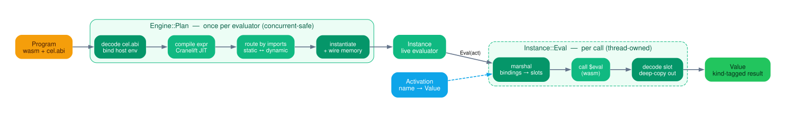
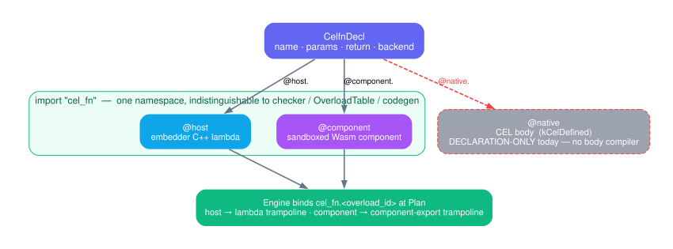

# Evaluator design — Plan, then Eval

Status: current — authored 2026-06-10, rewritten for clarity 2026-06-11.
This doc is `eval/`: how a compiled `Program` becomes a live `Instance`,
and how an `Activation` becomes a `Value`. The byte-level wire format
(CelValue layout, the kind table, error/unknown shapes) belongs to
[`03-abi-and-memory.md`](03-abi-and-memory.md); this doc cites it,
never restates it. System-wide context is
[`00-architecture.md`](00-architecture.md).

## 1. The shape of the thing

A `Program` is just bytes — wasm plus an embedded `cel.abi` descriptor.
The evaluator turns those bytes into answers, and it does so in **two
phases with very different costs**:

- **Plan** (once per Program): hand the bytes to wasmtime, which JITs
  them to native machine code; instantiate the runtime, wire up the host
  functions, set up memory. This is the expensive step. It returns an
  `Instance`.
- **Eval** (cheap, repeated): take an `Activation` (the variable
  bindings), write those values into the instance's memory, call the
  module's `$eval` function, and decode the `Value` it points at.

That split *is* the design. You pay the JIT and link cost once and
amortize it across as many `Eval`s as you like — which is the whole
reason to compile CEL ahead of time instead of interpreting it.

Four roles carry a Program from source to answer:

| Role | What it is | Lifetime |
|---|---|---|
| **`Compiler`** | produces the `Program` (pure bytes) | compile-time only; no wasmtime dependency |
| **`Engine`** | the process-shared machinery: one `wasm_engine_t` + the parsed `cel_runtime.wasm` | built once, shared across threads, thread-safe |
| **`Plan`** | the link step (`Engine::Plan(program) → Instance`) | called many times, concurrent-safe |
| **`Instance`** | one live evaluator: store, linker, instances, memory, `$eval`, decoded ABI, host env | thread-owned; outlives the Engine that made it |

Two ownership facts worth holding onto: the Engine is built once and
**shared** (it holds the parsed runtime module behind a `shared_ptr`, so
Plan is ~34× cheaper than re-parsing per call, ~64× with process
sharing), and an `Instance` keeps a reference to that shared state, so it
keeps working even after the `Engine` handle is dropped.

**Threading, in one line each:** registration (`Add*` / `Bind*`) is
single-threaded — configure the Engine, *then* share it; `Plan` is
concurrent-safe — each call makes its own store, linker, and memory and
shares only the thread-safe Engine; each `Instance` is owned by one
thread.

## 2. Plan — turn bytes into a callable thing

`Engine::Plan` is the link step. Conceptually it does four things:
read the ABI and build the host environment, stand up a fresh wasmtime
store and JIT the expression module, decide whether the runtime is
bundled or separate, then instantiate everything and grab `$eval`. In
order:

**Read the ABI, build the host environment.** This runs first because
it touches only the Program's raw bytes — no wasmtime state yet. The
`cel.abi` custom section is decoded into a proto, and from it we build
the per-Instance host environment: the field-reference table, the
attribute table (for partial eval), and the resolved proto descriptors.
A Program with *no* `cel.abi` section is fine — a variable-free
expression still evaluates — so synthetic WAT fixtures stay loadable.

Two **gates** run here, and both exist for the same reason — *fail loudly
once, at Plan, instead of cryptically at every Eval*:

- **ABI-version check.** The Program's runtime-ABI version must match the
  engine's. A mismatch is a `FailedPrecondition` naming both versions —
  far better than wasmtime's opaque type-mismatch trap at the first call.
- **Slot-extents gate.** Reject any Program whose ABI declares a variable
  slot reaching past the 8 KiB reserved window
  (`CELWASM_RESERVED_LOW_MEMORY_BYTES`). The compiler never emits such a
  slot — it validates the same bound before serializing (`01-compiler.md`
  §6.4) — so a Program that claims one is corrupt or stale, and honoring
  it would let the activation marshal (§6) write over the runtime's own
  memory. This is the eval-side half of that compile-side pair.

**Stand up the store and JIT the module.** A fresh wasmtime store, WASI
context, and linker (pre-loaded with the logging hook and every host
trampoline), then compile the expression module — *before* instantiating
anything, so its import list can be inspected.

**Decide the link mode — from the module, not the label.** Whether the
runtime is bundled into the Program (static) or a separate module
(dynamic) is determined by *what the module imports*: if it imports
anything from the `"cel"` namespace, it's dynamic. The `cel.abi`'s
link-mode label is **only a tripwire** — if it disagrees with the actual
import shape, Plan rejects the Program as mislabeled. The label never
*drives* the routing; the import shape does. (Why static is the default
and what each mode trades is `00-architecture.md` §3.)

**Instantiate.** In dynamic mode, instantiate the cached `cel_runtime.wasm`
first and define its `cel.*` exports on the linker — driven by the same
helper list the compiler's import pass uses, so the two can't drift.
Then bind the embedder's extensions (custom modules, host callbacks,
components — §3, §4, §9). Then instantiate the expression module and
pull out `$eval`. In static mode the runtime is already inside the
expression module, so there's nothing separate to instantiate — we just
alias the runtime handle to the expr instance and run the constructors.

**Finish wiring.** Either way, the last step clones the runtime's
exported **shared** memory onto the Instance (the runtime owns its
memory; the host never creates it — the wasi-threads build forces shared
memory), captures the `arena_alloc` / `malloc` handles the host
trampolines need, and calls `arena_init` once. `InstanceImpl`'s
destruction order is load-bearing — expr module, then memory, then
linker, then store.

## 3. Registration — teaching the Engine about host code

Before Plan, the embedder registers any custom functions and components.
All of this happens on the Engine and **none of it is thread-safe** —
configure first, share second. Each surface validates what it can at
registration and defers what genuinely needs a store to Plan.

- **`BindFunction(celfn_decl, lambda)` — the recommended path.** You
  describe the function in the same `.celfn` IDL the compiler reads
  (`bool @host.allow(this string user, string role);`) and hand over a
  lambda. The engine parses the decl, checks the lambda's parameter types
  positionally against the declared CEL types, and registers under the
  *synthesized* overload-id — so the engine-side binding and the
  compiler-side import name are derived from one source and **cannot
  diverge**. This is the surface to reach for.
- **`AddFunction(overload_id, num_args, callback)`** — the raw layer
  underneath: a bare callback keyed by overload-id (`num_args` counts the
  out-slot, so it's params + 1). Callbacks live in a `std::map`
  specifically so the trampoline can capture `&callback` and the node
  address stays stable as more are added.
- **`AddTypedFunction(id, lambda)`** — sugar over `BindTypedFunction`
  (§4) + `AddFunction` for when you have a typed lambda but no decl.
- **`AddModule(alias, bytes)`** — a foreign wasm module bound under an
  alias (reserved namespaces like `cel` / `cel_host` are rejected).
  Parsed at registration so syntax errors surface here, and reused across
  Plans.
- **`AddComponent(bytes, lib)`** — register a Component-Model component
  whose exports become CEL functions (§9). Conflicts are caught at
  registration (a clean `AlreadyExists`); the component is bound and
  resolved at Plan; **arity is checked at call time** — there is no
  Plan-time signature comparison, so a wrong-shaped export traps when
  first called, not when planned.

## 4. The host-call stack — L0, L1, L2

When the expression calls one of your `@host` functions, three layers
sit between the raw wasm call and your typed C++ lambda. Each layer
raises the abstraction by one notch:

- **L0 — the trampoline.** Adapts wasmtime's raw callback shape: the wasm
  args arrive as i32 slot offsets `(out_slot, arg_slots…)`. Before
  calling your function it does **3VL absorption** — if any argument is a
  `CEL_ERROR` or `CEL_UNKNOWN`, it copies that straight to the output and
  *skips* your function, matching CEL's dispatch semantics for strict
  functions (error wins over unknown; see §8). A non-OK status from your
  callback becomes a wasm trap.
- **L1 — `HostCallContext`.** Kind- and bounds-checked accessors over the
  raw 24-byte slots: ask for an int, get an `OutOfRange` if the index is
  wrong or an `InvalidArgument` if the kind is wrong. List and map
  arguments are lazy views valid only for the call's duration. Return
  setters go through the *same* encoder the built-in trampolines use, so
  your function's output is byte-identical to a built-in's.
- **L2 — `BindTypedFunction`.** A trait-based adapter from a typed lambda
  to the raw callback. It accepts **only canonical types** — the fallback
  trait is a `static_assert(false)`, so `int`, `float`, a by-value proto,
  or a non-`StatusOr` return is a *compile error naming the offending
  type*, not a runtime surprise. It also records the parameter kinds,
  which is what lets `BindFunction` validate a lambda against a decl
  without re-deriving the C++ types.

## 5. The cel_host surface — built-in operations

The built-ins the compiler emits calls to — field access, map/list
operations, proto construction, well-known-type handling — live behind
the `cel_host.*` imports. They're structured in three layers so the
*semantics* are testable without any wasm in the picture:

- **Layer 1 — backings.** Pure value semantics, no wasm types: abstract
  `HostMessage/Map/ListBacking` with concrete implementations — a
  non-owning view over a proto `Message*`, an owning mutable proto (the
  only thing field-writes accept), vector-backed maps/lists, and
  reflection views over a single proto field.
- **Layer 2 — trampoline bodies.** The operation logic, written against
  three abstractions: a `MemoryView` (read/write CelValue slots), an
  `ExternrefTable` (three independent handle namespaces — message, map,
  list — reset between Evals), and an `ArenaAllocator` (bump-allocates
  string/bytes payloads into linear memory).
- **Layer 3 — wasmtime glue.** The production implementations of those
  three abstractions, plus one `extern "C"` trampoline per import.

Registration is **bijection-checked**: the trampoline table and the ABI
catalogue must list exactly the same 20 `cel_host` imports, asserted at
startup, so the two can't drift.

**One call, end to end (`cel_get_field`):** wasm calls
`cel_get_field(out, msg, field_ref, attr)`; the glue builds a memory
view + arena allocator and forwards to Layer 2; Layer 2 reads the
operand *before* writing the output (aliasing the two slots is legal and
tested), absorbs unknown/error, rejects a non-message with a
type-mismatch *value* (not a trap), checks the partial-eval patterns
(and if one matches, writes a `CEL_UNKNOWN` and returns), then
dereferences the message handle; Layer 1 resolves the field descriptor
and reads it, applying proto presence rules and the well-known-type peel
chain (`Any` → wrapper → scalar, timestamps/durations → seconds+nanos);
Layer 2 writes the result back, interning any aggregate into the
matching handle namespace. The dividing line throughout: a non-OK
**Status** is infrastructure failure → trap; a langdef-level **error** is
a `CEL_ERROR` value in the output slot (§8).

The other trampolines follow the same shape. A few patterns worth
knowing:

- **Aggregate ops** (size / in / eq / concat / lookup / at) absorb 3VL
  first, then guard operand kinds with type-mismatch *poisons* rather
  than traps. Host-side element equality is scalar-only.
- **Comprehension snapshots** materialize a host aggregate into a fresh
  arena run; on non-host input or arena exhaustion they degrade to *empty
  iteration* — but a poisoned (unknown/error) range fails the eval loudly,
  because the comprehension prologue is supposed to have absorbed it
  already, so reaching the snapshot poisoned is a codegen regression, not
  a silent empty answer.
- **Proto construction** (`make_message` / `set_field`) uses a poison
  contract: an out-of-range write stamps an overflow error into the
  *message slot* and returns OK, and a later set-field on a poisoned slot
  is a no-op — so the error rides out of the construction as a value,
  matching cel-cpp's error-as-value semantics.
- **Single dispatch trampolines** collapse whole overload families: one
  trampoline serves all ten with-timezone timestamp accessors via a kind
  argument, another serves nine wrapper types — keeping the ABI surface
  small.

## 6. Marshal — getting variables into memory

`Instance::Eval(activation)` writes every ABI-declared variable into its
pre-assigned workspace slot before calling `$eval`. A missing binding is
a `FailedPrecondition`; a declared-type vs bound-kind mismatch is an
`InvalidArgument` — with three deliberate coercions the checker would
have allowed: `Value::Null()` binds into any scalar slot, a
well-known-type wrapper message peels to its inner scalar, and a
Timestamp/Duration message peels to (seconds, nanos).

One subtlety that's easy to get wrong and so worth stating plainly:
**bound string/bytes payloads do not go in the arena.** They go in a
separate per-Instance buffer, because `$eval`'s prelude calls
`arena_reset` — which would wipe an arena-resident payload before the
expression body ever read it. A pre-pass sums the bytes so the buffer is
grown *once*, before any encoder caches a memory pointer (growing it
mid-encode would invalidate that pointer).

**`PartialEval(activation, unknowns)`** is the same marshal with the
unknown-attribute patterns active for the call. A variable whose
attribute matches a pattern gets a `CEL_UNKNOWN` carrying its interned
attribute id — **whether or not it's bound** (the pattern wins over a
present value) — and the descriptor is minted in that same outside-the-
arena buffer for the same reason. Patterns are cleared on every exit
path, so a later plain `Eval` can never see stale partial-eval state.

## 7. Eval and decode — the cheap path

Zero-arg `Instance::Eval()` calls `$eval`, which returns one i32: the
offset of the result CelValue. The decoder reads the value there and
produces a host-owned `Value`. Aggregates are **deep-copied** out,
because their backings are per-Eval — the handle table and arena are
reset on the next call, so a decoded `Value` has to own its own state to
outlive that. A trap from `$eval` surfaces as an `Internal` error.

`Eval(activation)` is just: reset the handle table, clear partial-eval
patterns, marshal (§6), then `Eval()`.

A note on the `Value` model, since the headers have lied about it in the
past: every builder is real (scalars, unknown, error, type, and the
aggregate builders that live next to their backings). Equality is
`StructurallyEquals` — scalars by value, strings/bytes by bytes,
aggregates by backing-pointer identity — and it is **deliberately not
spec equality**. `Value::Kind` matches the wire kind numbering only for
the first nine kinds and diverges above that on purpose, so conversion is
always an explicit switch, never a cast.

## 8. Errors and unknowns

The byte-level contract lives in `03-abi-and-memory.md` §8; here is what
the evaluator actually implements, and it reduces to one rule:

> **A spec-level error travels as a value; a non-OK `Status` means a
> trap.** Every trampoline returns a non-OK Status *only* for
> infrastructure failure (a bad handle, arena exhaustion, missing
> reflection). Every langdef error is a `CEL_ERROR` CelValue written to
> the output slot. `StatusToTrap` / `TrapFromStatus` are the only places
> the two cross.

Two specifics that are real and worth knowing:

- **Error *messages* are dropped at the host→wasm boundary.** The wire
  carries only the error *code*; the message and source location are
  discarded, and read-back synthesizes a generic message from the code.
  This is a known limitation (cleanup-backlog #31), not a deep
  invariant — the wire could carry the message; it just doesn't yet.
- **3VL precedence is "error dominates unknown," regardless of operand
  order** — oracle-confirmed against cel-cpp, which scans arguments for an
  error before merging unknowns. Both the kernel and the host trampolines
  implement this.

## 9. Components — sandboxed custom functions

The component path makes a Component-Model component's exports callable
as CEL functions, with the component running in its **own** linear memory
(the strong-isolation story is the security model's; the mechanics are
here). At Plan, each registered component is instantiated into the
per-Plan store and each foreign decl is bound as a `cel_fn.<overload_id>`
trampoline — the wasm import shape is identical to an `@host` decl; only
the callback body differs.

The trampoline 3VL-absorbs (same contract as the host-call stack), lifts
each argument CelValue into a component value per the decl's type
witness, calls the component, and lowers the single result back. The type
mapping is the interesting part: strings are length-based (NUL-safe),
bytes cross as `list<u8>`, durations/timestamps as a `record{seconds,
nanos}`, maps as a `list<tuple<K,V>>`, and **protos cross as serialized
bytes** (never a handle) and are re-materialized from the descriptor pool
on the way back. `optional<T>` is rejected both directions.

Unsatisfied wasi-preview2 imports are **trap-stubbed** — a runaway libc++
call traps naming the missing interface rather than escaping — with one
deliberate exception: `wasi:random/random` returns deterministic bytes,
because the wasi-sdk libc++ reads it during static init for its string
hash seed and there's no per-store WASI context to wire instead.

## 10. Known gaps and future work

- **Host-callback status codes are lost.** A callback returning, say,
  `InvalidArgument("boom")` surfaces to the embedder as a generic
  `Internal` "Eval trapped" — the code and message don't survive the trap
  path (cleanup-backlog #31, same root as the error-message loss in §8).
  These should be fixed as one contract.
- **No Plan-time component signature check.** A wrong-arity component
  export fails at call time, not Plan; whether to add a Plan-time
  `FuncType` comparison (and fix the stale header that claims one) is open.
- **Per-Plan expr re-parse.** The expression module is re-parsed every
  Plan; a cache seam exists but is unexploited.
- **Cross-origin list concat** poisons host-involved pairs with a
  type-mismatch; the planned fix is to materialize into the arena instead.
- **Dynamic-schema descriptor pools** (today only statically-linked
  descriptors resolve), field-descriptor caching, and the kType component
  lower stub are smaller follow-ons.

The unverified questions catalogued during the notes pass (the exact
component-arity trap site, zero-arg `Eval()` handle-table growth, and the
host-callback status-code contract) live in the
[`design/notes/`](https://github.com/augustinemathew/cel-spec-wasm/tree/master/doc/design/notes)
working material rather than inline, so they don't clutter the design.

## History

This doc supersedes the evaluator-surface content of the milestone-era
plans under `doc/implementation-plan/rewrite/` — `cel-host-surface.md`
(surface sections; its wire sections went to `03-abi-and-memory.md`),
`m21-host-call-adapter.md`, the eval half of
`two-phase-runtime-isolation.md`, and the eval sections of
`m24-foreign-fn-component-backend.md` — each of which carries an archive
banner pointing here. Where this doc contradicts a stale public-header
comment (`engine.h`'s AddComponent/memory text, `value.h`'s builder and
numbering claims, `instance.h`'s decode claims), this doc is the
corrected record and those headers are fixed in the same change.
