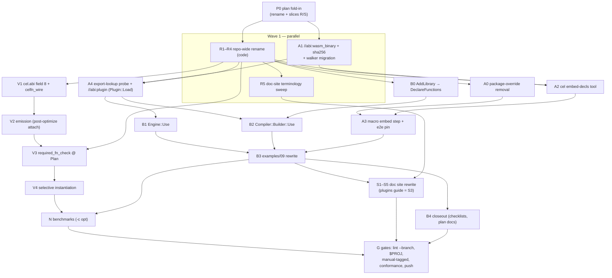

# m35 — execution DAG

Status: FROZEN 2026-07-25 — the milestone shipped; this is the
as-executed record.  (Was: live tracking doc, created 2026-07-25.)
Late additions executed beyond the original graph: in-PR review
fixes (BoringSSL sha256, FnType→Type generalization, bench-tier
move) and the user-directed CelfnType→CelType unification
(backlog #53), all gated in G.  Node definitions live in the plan doc §12 —
this file adds only ordering, parallelism, and status.

Goal state: full e2e green (unit + e2e + manual-tagged + conformance
monotonic), doc site rewritten (wasm-plugin guide included), branch
pushed.

## DAG

## Constraints the schedule honours

  - **One checkout, one bazel output base.**  Bazel serializes on
    the workspace lock, so at most ~2 build-heavy agents run
    concurrently; docs agents are free.  Worktree isolation was
    rejected: a fresh worktree pays the ~10-min cold cel-cpp build.
  - **R lands first** among code slices so A/V/B are written under
    final names (no post-hoc rename of new code).  A1 is the one
    exception: file-disjoint from R (new `abi/` files +
    `abi_decode*`/`compile_test` edits R doesn't touch), so it runs
    in Wave 1.
  - **Commit per slice**, repo commit conventions.  **No per-slice
    lint**: lint (PCH build + clang-tidy) serializes behind bazel
    and contends with agent builds — `scripts/lint.sh --branch`
    runs exactly once, at the final gate (G).
  - **No per-slice test runs either** (user call, late in the
    milestone): agents verify compile-only (`bazel build`); the
    full test pass — `$PROJ`, manual-tagged catalog, conformance —
    runs exactly once, at the final gate (G).
  - No broad process kills; agents scope any cleanup to their own
    PIDs (shared machine).

## Waves & status

| Wave | Node | Agent | Status |
|---|---|---|---|
| 0 | P0 plan fold-in (rename + R/S slices + this DAG) | orchestrator | done |
| 1 | R1–R4 code rename | agent-R | done (e9dd240; $PROJ 151/151, conformance 2035/2035 both modes) |
| 1 | A1 wasm_binary + sha256 + migration | agent-A1 | done (eb2f0f7, 692e474, 5736b7a, bc1b485) |
| 1→2 | R5 doc terminology sweep (after R names verified) | agent-R5 | done (e823a76; writing-plugins.md live, CLEANUP_PLAN/PROPOSALS updated as live registers) |
| 2 | A0 + A2 + A3 (tool + macro chain) | agent-A | done (d3265dd embed-decls tool; 2bdab21 macro embed step + package-override removal; gates: //tools + //abi:plugin_test + //e2e 70/70 incl. manual-tagged plugin/host/matrix targets, bazel build //... 303 targets; demo wit_interface cel:customfn/fns@0.1.0; demo_plugin_proto blocked by pre-existing absl-sync wasm32-wasip2 cross-compile break, unrelated) |
| 2 | A4 probe + Plugin::Load (//abi:plugin) | agent-A4 | done (1c4e0fb probe: static export lookup EXISTS in pin — B1 goes static; 25b5bf4 Plugin::Load) |
| 2 | V1 + V2 (wire + emission) | agent-V | done (ec658ab, d2cfb3c, f53692f; O2-import-drop pin green both link modes; conformance 2035/2035 both legs; delta: FN_KIND_NULL=14 added) |
| 3 | B0 + B1 + B2 (one agent — B and V3 share eval/engine.cc, so serialized) | agent-B | done (8ff6ce4 DeclareFunctions; 42ab8dc Engine::Use static check + hash; 0140dd4 Builder::Use + #44 hardening; 3c3f843 one-noun e2e both link modes; 108/108, R36 resolved) |
| 3 | V3 + V4 (check + selective instantiation; after B — §5.3 messages cite Engine::Use) | agent-V34 | done (869621a required_fn_check + BindFunction typed capture + e2e negatives; ff1a97d selective instantiation + §6.4 pins incl. verified-failing-before proof; gates: //eval+//e2e 88/88 + all 17 manual-tagged, bazel build //... 303 targets, conformance 2035/2035 both legs; deltas recorded in plan §5.3/§6.4 callouts: BindFunction-mismatch message shape, legacy-hash rendering `hash unavailable; registered via AddPlugin`, empty-table = legacy instantiate-all) |
| 4 | B3 examples + demo e2e | agent-B3 | done (24d70e3; mirror + SetWitInterface deleted, smoke green) |
| 4 | N benchmarks (user-scoped: compile-path only) | agent-N | done (605e9e7; moved to benchmark/compiler in 5cf512a per PR review) |
| 5 | S1–S5 doc site (parallel per page group) | agent-S | done (a8d828d, cb90689, b5ab6ef, 0690648, 75074a5, dc42913, 57eb983; all quoted strings grep-verified; diagrams regenerated) |
| 6 | B4 closeout (testing-checklist, plan-doc status) | orchestrator | done (checklist M35 + unification sections; plan status → shipped; backlog #51/#52/#53 filed, #53 executed in-PR) |
| 6 | G gates: lint --branch, bazel test $PROJ, manual-tagged suite, conformance monotonic, push | orchestrator | done ($PROJ 155/155; run_full_suite.sh green; conformance 2035/2035 both legs; lint clean modulo lint-backlog-tracked exceedances + infra gaps; pushed to PR #24) |

Carry-forward notes for closeout (B4):
  - Pre-existing breakage found during A3 (NOT m35's): manual target
    `//e2e/plugin_fixtures/cel_wasm_plugin_demo:demo_plugin_proto`
    fails to cross-compile — `@abseil-cpp` `synchronization/mutex.cc`
    under wasm32-wasip2 (`std::this_thread` missing); byte-identical
    action inputs pre/post m35, likely an absl-bump regression.
    File a cleanup-backlog entry at closeout.
  - Multi-agent shared-checkout discipline that worked: commit via
    `GIT_INDEX_FILE` temp index, always; three plain-index commits
    each swept a sibling's staged state (all caught + repaired).
