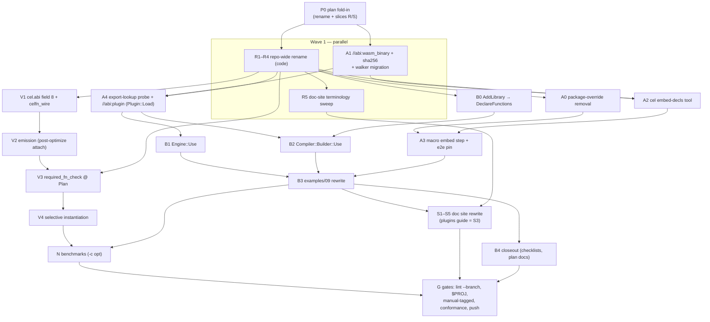

# m35 — execution DAG

Status: live tracking doc for executing `m35-plugin-ergonomics.md`
(created 2026-07-25).  Updated as nodes complete; deleted or frozen
at milestone closeout.  Node definitions live in the plan doc §12 —
this file adds only ordering, parallelism, and status.

Goal state: full e2e green (unit + e2e + manual-tagged + conformance
monotonic), doc site rewritten (wasm-plugin guide included), branch
pushed.

## DAG

## Constraints the schedule honours

  - **One checkout, one bazel output base.**  Bazel serializes on
    the workspace lock, so at most ~2 build-heavy agents run
    concurrently; docs agents are free.  Worktree isolation was
    rejected: a fresh worktree pays the ~10-min cold cel-cpp build.
  - **R lands first** among code slices so A/V/B are written under
    final names (no post-hoc rename of new code).  A1 is the one
    exception: file-disjoint from R (new `abi/` files +
    `abi_decode*`/`compile_test` edits R doesn't touch), so it runs
    in Wave 1.
  - **Commit per slice**, repo commit conventions.  **No per-slice
    lint**: lint (PCH build + clang-tidy) serializes behind bazel
    and contends with agent builds — `scripts/lint.sh --branch`
    runs exactly once, at the final gate (G).
  - No broad process kills; agents scope any cleanup to their own
    PIDs (shared machine).

## Waves & status

| Wave | Node | Agent | Status |
|---|---|---|---|
| 0 | P0 plan fold-in (rename + R/S slices + this DAG) | orchestrator | done |
| 1 | R1–R4 code rename | agent-R | pending |
| 1 | A1 wasm_binary + sha256 + migration | agent-A1 | done (eb2f0f7, 692e474, 5736b7a, bc1b485) |
| 1→2 | R5 doc terminology sweep (after R names verified) | agent-R5 | pending |
| 2 | A0 + A2 + A3 (tool + macro chain) | agent-A | pending |
| 2 | A4 probe + Plugin::Load (//abi:plugin) | agent-A4 | pending |
| 2 | V1 + V2 (wire + emission) | agent-V | pending |
| 3 | B0 + B2 (compile-side surface) | agent-Bc | pending |
| 3 | B1 (Engine::Use) | agent-Be | pending |
| 3 | V3 + V4 (check + selective instantiation) | agent-V34 | pending |
| 4 | B3 examples + demo e2e | agent-B3 | pending |
| 4 | N benchmarks | agent-N | pending |
| 5 | S1–S5 doc site (parallel per page group) | agents-S | pending |
| 6 | B4 closeout (testing-checklist, plan-doc status) | orchestrator | pending |
| 6 | G gates: lint --branch, bazel test $PROJ, manual-tagged suite, conformance monotonic, push | orchestrator | pending |
