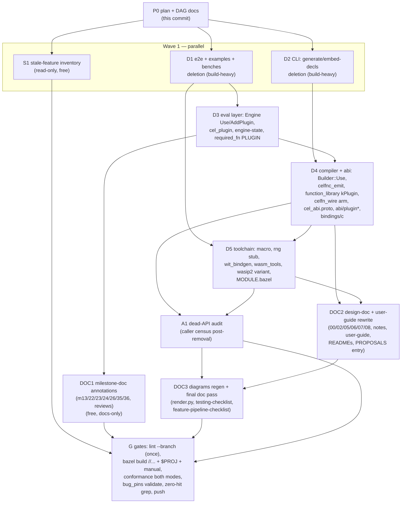

# m39 — execution DAG

Status: live tracking doc, created 2026-08-04.  Node definitions live
in `m39-component-removal.md` (§3 inventory, §4 commit plan, §5 docs,
§6 dead-API audit, §7 stale-feature inventory) — this file adds only
ordering, parallelism, and status.

Reconciled with master 2026-08-05 (rebase onto 9a85cd8 after #38/#39 merged; clean by construction — merge commits, ancestor base).

Goal state: zero component/plugin code or docs outside the archive
branch and history annotations; host-callback custom functions fully
intact; stale-feature inventory delivered; full gates green
(`bazel build //...`, `$PROJ` + manual-tagged, `lint.sh --branch`,
conformance monotonic both modes, `bug_pins.py validate`); branch
pushed.

## DAG

## Constraints the schedule honours

  - **One checkout (`rip-out-components`), one bazel output base.**
    Bazel serializes on the workspace lock: at most 2 build-heavy
    agents concurrent (D1+D2 is the only build-heavy pair; every
    later build node is serial).  Docs/read-only agents (S1, DOC1,
    DOC2) are free and overlap anything.
  - **Disjoint file sets per concurrent agent.**  D1 owns
    `e2e/ examples/ benchmark/`; D2 owns `tools/cel/`.  Each agent
    stages ONLY its own paths (`git add <explicit paths>`, never
    `-A`) and tolerates the other's in-flight edits in `git status`.
  - **No lint in agent loops** — lint (PCH + clang-tidy) contends
    with builds; `scripts/lint.sh --branch` runs exactly once, at G.
    Agents verify with `bazel build` / `bazel test` on touched
    packages only.
  - **No broad process kills** — agents scope cleanup to their own
    PIDs; never `pkill -f` (shared machine).
  - **Tree green after every node's commit** — each node ends with
    its packages building + testing, one commit (or a small series),
    message citing m39.
  - **Docs ship with the change** where the change is user-facing:
    D2 updates `tools/cel/README.md` in its own commit; the broad
    doc rewrite is DOC2/DOC3.

## Status

| Wave | Node | Owner | Status |
|---|---|---|---|
| 0 | P0 plan + DAG docs | orchestrator | done (this commit) |
| 1 | S1 stale-feature inventory | agent | done (478c3ec) |
| 1 | D1 e2e/examples/benches | agent | done (a3f5c62; foreign_fn_type_matrix was plugin-only → deleted whole; ArgkindSlug coverage handoff → D4) |
| 1 | D2 CLI | agent | done (fda6124; its staged deletions were swept into 478c3ec by an orchestrator commit — content correct, wrong message; orchestrator now commits with pathspecs while agents share the tree) |
| 2 | D3 eval layer | agent | done (1335bbc, +204/−3835; found @native eval consumer NativeBackendRejected → D4; fixed D1 dangling manual-tagged data dep) |
| 2 | DOC1 milestone annotations | agent | done (b37df50; 13/13 annotated, history untouched) |
| 3 | D4 compiler + abi | agent | done (541ffea → 5f2a9fb post-rebase, +242/−5589; census: wasm_binary KEEP, sha256 DELETE; @native parse error probed+pinned; new A1 candidate: ImportModuleSource::kUser zero producers) |
| 4 | D5 toolchain | agent | done (71f865c, +16/−840; //... green 322 targets; DEVIATIONS: bazel/ NOT plugin-only — kept catalogue gen + link-mode macro; dead boringssl dep removed; new A1 candidates: toolchain threads attr single-setting) |
| 4 | DOC2 design docs + user guide | agent | running |
| 5 | F1 ofNonZeroValue(message) full-depth delete | agent | running |
| 5 | F2 stale-skip un-skips | agent | running |
| 5 | A1 dead-API audit | agent | pending |
| 5 | DOC3 diagrams + final pass | agent | pending |
| 6 | G gates + push | orchestrator | pending |
